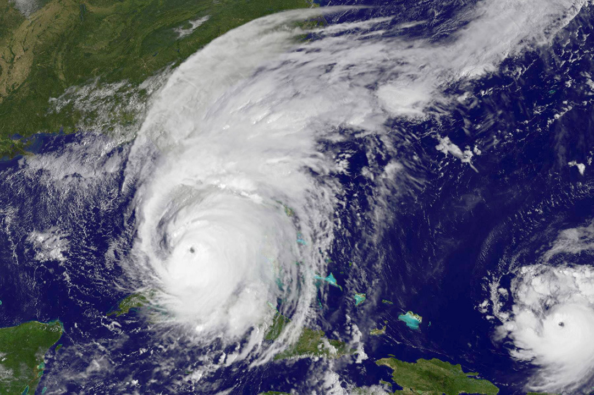

## Storms are increasing in frequency and severity

Outlier events are becoming more common, maximum storm strengths are increasing, and storms are occuring over wider and/or shifting areas and times of year. 

In 2017 alone, Hurricane Irma was so strong that scientists proposed a new “Category 6",[@book-UninhabitEarth, p.81] Hurrcane Harvey dropped a "500-1000" year rainfall on Houston (the equivalent of a million gallons for nearly every person in Texas), and South Asia floods displaced 45 million.[@book-UninhabitEarth, p.79] In the US, damages from thunderstorms have increased 7x since 1980’s. And power outages have doubled since 2003.[@book-UninhabitEarth, p.80]

Per the 2019 IPCC Ocean and Cryosphere report:

> \[C\]limate change…is increasingly driving extreme climate and weather events across the globe including compound events (high confidence)…[T]he number of recent studies and wide range of phenomena addressed suggests increasing influence of climate change on extreme events.[@rep-OceanCryosphere-IPCC-19, p. 6-10]

### Hurricanes

Climate change has increased the intensity of hurricanes.

> Anthropogenic climate change has increased precipitation, winds and extreme sea level events associated with a number of observed tropical- and extra-tropical cyclones (high confidence). For example, studies have shown that the rainfall intensity of tropical cyclone Harvey increased by at least 8% due to climate change.[@rep-OceanCryosphere-IPCC-19, p.6-3]

[Hurricane Irma](https://en.wikipedia.org/wiki/Hurricane_Irma) and [Maria](https://en.wikipedia.org/wiki/Hurricane_Maria) were each “once in a generation”, Category 5 storms. They came within two weeks of each other, in 2017. [@book-UninhabitEarth, p.81] Irma is regarded as the "worst natural disaster in recorded history" for the islands of Puerto Rico, the US Virgin Islands, and Dominican Republic.[@wiki-HurricaneMaria]

> Three major Caribbean storms, Harvey, Irma and Maria, occurred in 2017, with loss and damage to the tourism industries of Dominica, the British Virgin Islands, and Antigua and Barbuda estimated at US $2.2 billion, and environmental recovery costs estimated at US $6.8 million (UNDP, 2017).[@rep-OceanCryosphere-IPCC-19, p. 5-94]

Confidence varies on the degree to which human factors are the cause.Worth remembering that IPCC estimates and assertions of confidence tend to be conservative.

> \[T\]he report says there is “medium confidence” that human-caused climate change has already increased the amount of rainfall associated with some cyclones, as well as “low confidence” around increased wind speeds and “high confidence” of increases in their associated extreme sea level events.[@web-IndepthIPCCSpecial-19]

==TODO: How climate change makes hurricanes worse	 section. 25-30% increase in Category 4 and 5 hurricanes for 1°C warming. [@book-UninhabitEarth, p.81] (need to double check that citation, though).==

==TODO: El Niño and La Niña section. They are increasing in occurrence and severioty. Pull from IPCC report for data.==

### Rain

* Climate change increases rainfall because warmer air can hold more moisture than cool air. [@book-UninhabitEarth, p.80]
* There are 40% more intense rainstorms in the US than in the middle of the last century. In the Northeast, 71%. [@book-UninhabitEarth, p.80]
* The heaviest downfalls are 3/4 heavier than in 1958. And getting heavier.
* Kauai (Hawaii), April 2018: Already one of wettest places on earth. Climate driven rain event broke rain gauges. 50” of water in 24 hours. [@book-UninhabitEarth, p.80] 

### Blizzards

“The warmer the Arctic, the more intense the blizzards in north latitudes.” This is what drove intense blizzards in 2010, 2014, 2016 (aka “Snowpocalypse”, etc)  [@book-UninhabitEarth, p.82]

### Tornadoes

* April 2011: 758 tornadoes in US countryside. Up from 267 in 2010. Previous April record was 542. [@book-UninhabitEarth, p.82]
* “Tornado alley” has moved 500 miles in 30 years. [@book-UninhabitEarth, p.82]
* Destruction paths are getting longer, and wider. [@book-UninhabitEarth, p.83]
* Scientists unsure if climate change increases tornado formation. But thunderstorms—which create tornadoes—are increasing. The number of days on which they are possible could grow as much as 40% by 2100. [@book-UninhabitEarth, p.83] ==TODO: Check citation.==

### Wave heights

> Extreme wave heights across the globe have increased by around 5% over the past three decades (medium confidence).[@rep-OceanCryosphere-IPCC-19, p. 6-3]

### Industrial spills

* Storms in turn trigger human pollution: chemical/oil spills, garbage, etc.
* Houston, [Hurricane Harvey](https://en.wikipedia.org/wiki/Hurricane_Harvey) (Aug 2017):  half a billion gallons on industrial waste water surfed out of single petrochemical plant in Galveston Bay. [@book-UninhabitEarth, p.84]
* 100 other “toxic releases”. Including 460,000 gallons of gasoline, 52,000 pounds crude oil, massive quarter-mile wide discharge of hydrogen chloride, which becomes hydrochloric acid when mixed with moisture.
* There are 175 oil rigs in the Gulf of Mexico alone.[@web-NumberOffshoreRigs]

## Asia and tropical islands have been particularly effected

Asia:

* Since 1970, typhoons intensified 12 and 15%. [@book-UninhabitEarth, p.82]
* Proportion of Cat 4 and 5 stor  ms doubled in some areas. [@book-UninhabitEarth, p.82]
* Philippines hit 75 natural disasters, 2006-2013

Tropical islands:

> Natural disasters already cost Pacific Island Countries and Territories between 0.5‒ 6.6 % of GDP per year (World Bank, 2017), with localized damages and losses from individual storms far exceeding these estimates (e.g., 64% of Vanuatu’s GDP for Cyclone Pam in 2015).[@rep-OceanCryosphere-IPCC-19, p. 5-94]

> In 2015, tropical storm Erika devastated Dominica causing $483 million USD in damages and losses (mostly related to transport, housing and agriculture), equivalent to 90% of Dominica’s GDP (World Bank, 2017)[@rep-OceanCryosphere-IPCC-19, p. 5-94]

## The more we emit, the worse that future storms will be

* 4°C scenarios. 
* Hurricane Sandy, NYC. By 2100, floods of that scale will be 17x more frequent. [@book-UninhabitEarth, p.81]. ==TODO: Check citation for details.==
* Katrina-level hurricanes will double in frequency. [@book-UninhabitEarth, p.81].  ==TODO: Check citation for details.==

### Hurricanes intensity and impacts will increase

> An increase in the average intensity of tropical cyclones, and the associated average precipitation rates is projected for a 2°C global temperature rise (medium confidence), although there is low confidence in future frequency changes at the global scale. Rising sea levels will contribute to higher extreme sea levels associated with tropical cyclones in the future (very high confidence). Projections show that the proportion of Category 4 and 5 [tropical cyclones] will increase (medium confidence). Such changes will affect storm surge frequency and intensity, and impact coastal infrastructure and mortality.[@rep-OceanCryosphere-IPCC-19, p. 6-4]

### El Niño and La Niña events will become more frequent and severe

> Extreme El Niño and La Niña events are likely to occur more frequently with global warming and are likely to intensify existing impacts, with drier or wetter responses in several regions across the globe, even at relatively low levels of future global warming (medium confidence).[@rep-OceanCryosphere-IPCC-19, p. 6-4]

### Increasing wave heights

> Wave heights are projected to increase across the Southern Ocean, tropical eastern Pacific and Baltic Sea and decrease over the North Atlantic and Mediterranean Sea under RCP 4.5 and RCP 8.5 (high confidence). There is still limited knowledge on projected wave period and direction. Accounting for the multiple contributions of waves, tides, storm surges and sea level rise, probabilistic projections of extreme sea levels predict the global average 100-year extreme sea level to very likely increase by 34–76 cm and 58– 172 cm, under RCP4.5 and RCP8.5, respectively between 2000 and 2100.[@rep-OceanCryosphere-IPCC-19, p. 6-4]

### Costs will skyrocket

Per the 2019 IPCC Ocean and Cryosphere report:

> Impacts from further changes in tropical and extra-tropical cyclones, marine heatwaves, extreme El Niño and La Niña events and other extremes will exceed the limits of resilience and adaptation of ecosystems and people, leading to unavoidable loss and damage[@rep-OceanCryosphere-IPCC-19, p. 6-5]

In particular, for coastal regions (tropic islands especially):

> Overall, there is high confidence that sea level rise, increases in storm intensity and other extreme events will impact the values of coastal real estates and infrastructure, particularly in tropical SIDS, through the risk and impacts of direct physical damages.[@rep-OceanCryosphere-IPCC-19, p. 5-95]

USA: 

> For the USA, Ackerman and Stanton (2007) forecast that annual real estate losses due to climate change could increase from 0.17% of GDP in 2025 to 0.36% in 2100, with Atlantic and Gulf Coast states being the most vulnerable.[@rep-OceanCryosphere-IPCC-19, p. 5-94]

Florida:

* In the Florida Keys, 150 miles of road need to be raised to stay ahead of sea level, costing as much as $7 million each mile, or up to $1 billion, total. The county’s 2018 road budget was $25 million.” [@book-UninhabitEarth, p.85]

Asia:

* By 2070, “Asian megacities could lose as much as $35 trillion in assets due to storms, up from just $3 trillion in 2005.” [@book-UninhabitEarth, p.82]
* Costs will depend in part on the insurance, and adaptation expenses. “\[Which\] in turn depend on the willingness to pay by asset holders and wider society, including local and national governments.”[@rep-OceanCryosphere-IPCC-19, p. 5-94]
	

### Climate change increases the odds of the "ARkStorm"—the *other* possible "big one" in California

* US Geological Survey investigated the scenario. Found the following. [@book-UninhabitEarth, p.83]
  * Winter storms hit Cali. Produce flooding in LA, Orange County, Bay Area. 
  * Force evacuations of 1 million.
  * Wind speeds reach hurricane levels (125 mph) in parts of the state, and 60 throughout much of it.
  * Landslides from Sierra Nevada mountains. 
  * Damage: $725 billion. 3x the estimate for the anticipated “Big One” quake. 
* Hits every few hundred years on average
* Climate change increases the odds of it, because of increased precipitation. 

## Adaptation may give way to abandonment

* So far we keep rebuilding. Especially in rich countries.
  * New Orleans after Katrina.
* At some point, people will walk away.
  * Puerto Ricans leaving the territory after Maria. ==TODO: Find numbers.==
  
  ==TODO: Explore the 3 strategies for sea level rise: Adapt, Retreat, Abandon(?)==