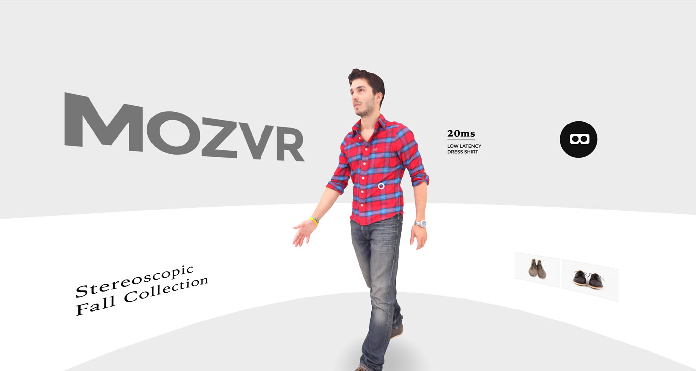
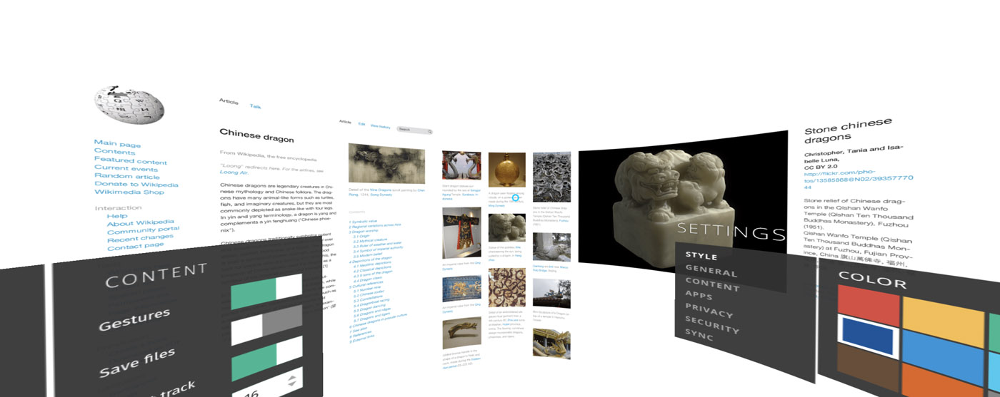
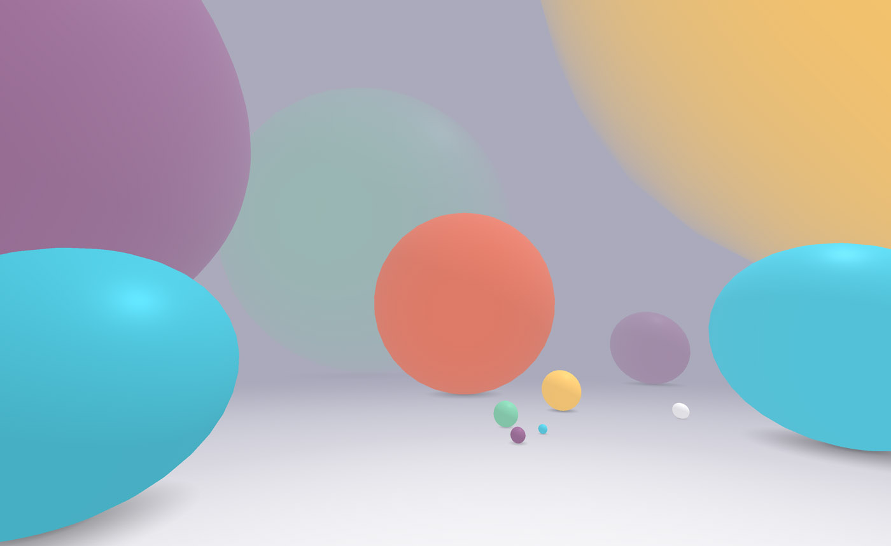
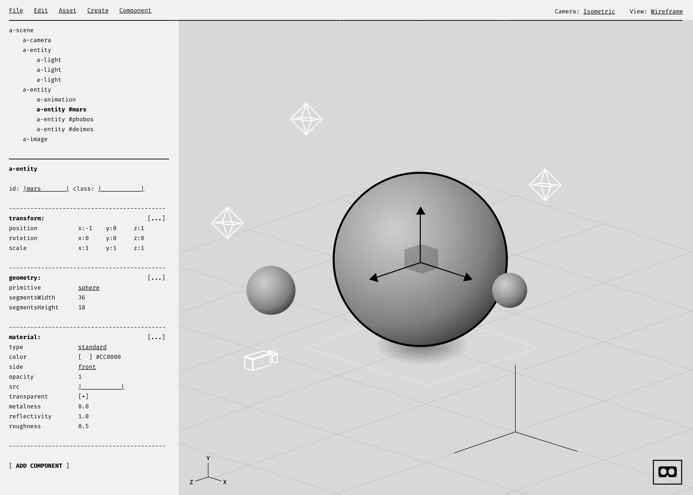

_2015_{.timeframe} – [A-Frame](https://aframe.io) is a tool for building virtual reality web experiences. It was created by the [Mozilla VR](/mozilla-vr/) team in 2015. At the time, most existing 3D web development tools were very complex, and/or pre-dated VR. We wanted to give developers a way to create VR web sites that was as easy to start with as HTML, while also being fully extensible for more advanced users.

The project grew out of our team's internal prototyping efforts. I was designing and implementing various VR web experiences, and devs were creating tools to help speed up iteration. One of those tools became A-Frame. Started by [Diego Marcos](https://twitter.com/dmarcos), A-Frame makes it possible to build 3D worlds from HTML elements, such as `<a-cube>` and `<a-sky>`. Under the hood, a robust and extensible [entity component system](https://en.wikipedia.org/wiki/Entity_component_system) made it possible for power users to create their own building blocks using JavaScript, and then share those building blocks with others, fostering community. A-Frame was announced at View Source 2015, and released at the end of that year. Under the stewardship of Diego, [Kevin Ngo](https://twitter.com/kevopuff), and open source [contributors](https://github.com/aframevr/aframe/graphs/contributors), it has since grown into one of the largest [VR communities](https://aframe.io/community/) and most popular ways to create VR web content, with tens of thousands of devs worldwide.

My role on the team was Product and UX lead: helping to define requirements as an internal customer, contributing to the API, creating demos, writing docs, and designing the rollout touchpoints (logo, site, etc).

<figure>
        <video playsinline autoplay loop muted>
                <source src="img/aframe-logo.webm" type="video/webm; codecs=vp9,opus"></source>
                <source src="img/aframe-logo.mp4" type="video/mp4"></source>
        </video>
        <figcaption>A-Frame logo, animated in A-Frame</figcaption>
</figure>

