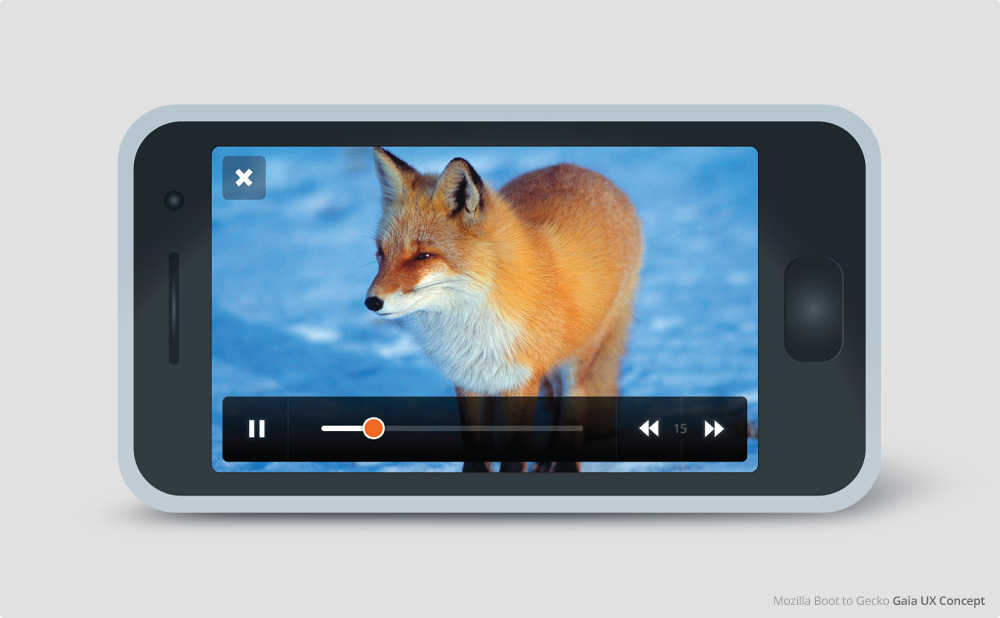

_2012/13_{.timeframe} – Firefox OS was Mozilla’s attempt to build a mobile operating system from web technologies. I joined the team in 2012 to design the initial proof-of-concept, then stayed on as Interaction Design lead for versions 1 and 2. I am particularly proud of the “Haida”^[So named after the [Haida indigenous peoples](https://en.wikipedia.org/wiki/Haida_people) of British Columbia, Canada, where I grew up. I've since learned better than to appropriate the names of entire peoples for something as tacky as a product codename—or anything else—and I regret the choice.] concept we created for version 2. It stepped out of the shadow of iOS and Android design conventions and defined a uniquely webby experience, where using the phone was as seamless and low-friction as browsing the web. Haida successfully anticipated features that later became part of Android and iOS, such as edge gestures and instant apps. 

Firefox OS ultimately failed in the market was discontinued, but it lives on today in [KaiOS](https://www.kaiostech.com/) phones around the world, and in Panasonic smart TVs, both of which run on forks of the open source Firefox OS [core](https://github.com/mozilla-b2g/B2G).

<iframe style="aspect-ratio: 4/3" src="https://player.vimeo.com/video/618212309?h=db01b4221b&color=ffffff&title=0&byline=0&portrait=0" width="404" height="720" frameborder="0" allow="autoplay; fullscreen; picture-in-picture" allow
fullscreen title="Firefox OS &amp;quot;Haida&amp;quot; Gestures" data-caption="Firefox OS 2.0: Edge gestures for app switching, accessing notifications, and more."></iframe>

<iframe style="aspect-ratio: 4/3" src="https://player.vimeo.com/video/618212292?h=db01b4221b&color=ffffff&title=0&byline=0&portrait=0" width="406" height="720" frameborder="0" allow="autoplay; fullscreen; picture-in-picture" allowfullscreen title="Firefox OS &amp;quot;Haida&amp;quot; Universal Search" data-caption="Firefox OS 2.0: System-wide search and browsing."></iframe>

, [Peter La](https://www.instagram.com/artofpeterla/) and [Przemek Abratowski](https://www.linkedin.com/in/przemek-abratowski).](img/ffos-haida-vsd-overview.jpg)

<iframe style="aspect-ratio: 16/9" src="https://player.vimeo.com/video/618212244?h=2342ef16dd&color=ffffff&title=0&byline=0&portrait=" width="1280" height="720" frameborder="0" allow="autoplay; fullscreen; picture-in-picture" allowfullscreen title="Firefox OS &amp;quot;Haida&amp;quot; Overall Concept" data-caption="Early concept animation of core Haida concepts: treating apps and sites as equals, 'opening' apps instead of 'installing', etc." data-caption="Early Firefox OS 2.0 concept video showing key features: Gestures, system-wide search, and instant apps."></iframe>

Before Firefox OS became a real project, there was a proof-of-concept prototype, built hastily in advance of Mobile World Congress 2012 to show the world that a mobile operating system could be built on the web stack. I joined the effort to help create icons, and ended up designing the full interface. While _very_ rushed (the home screen was slapped togther in one night in a hotel room in Paris) and dated, I think overall it holds up well.

