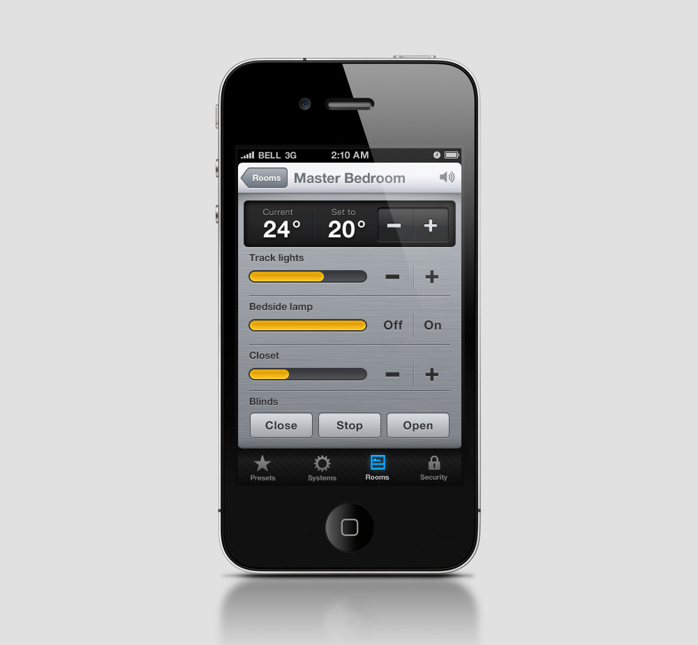
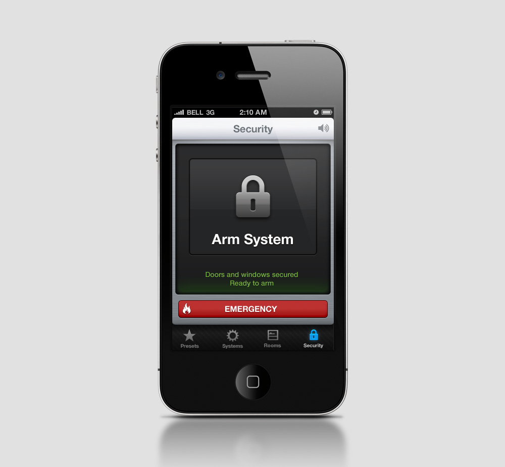
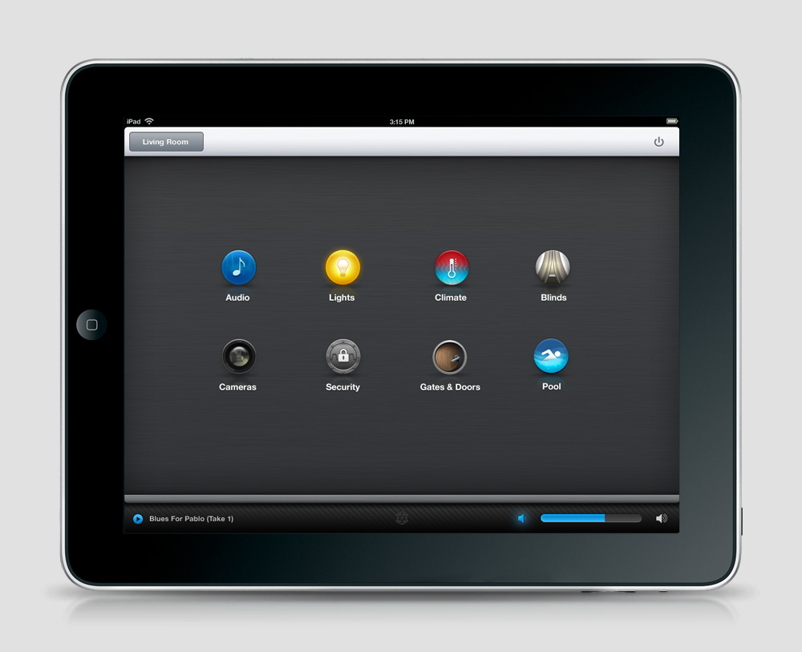
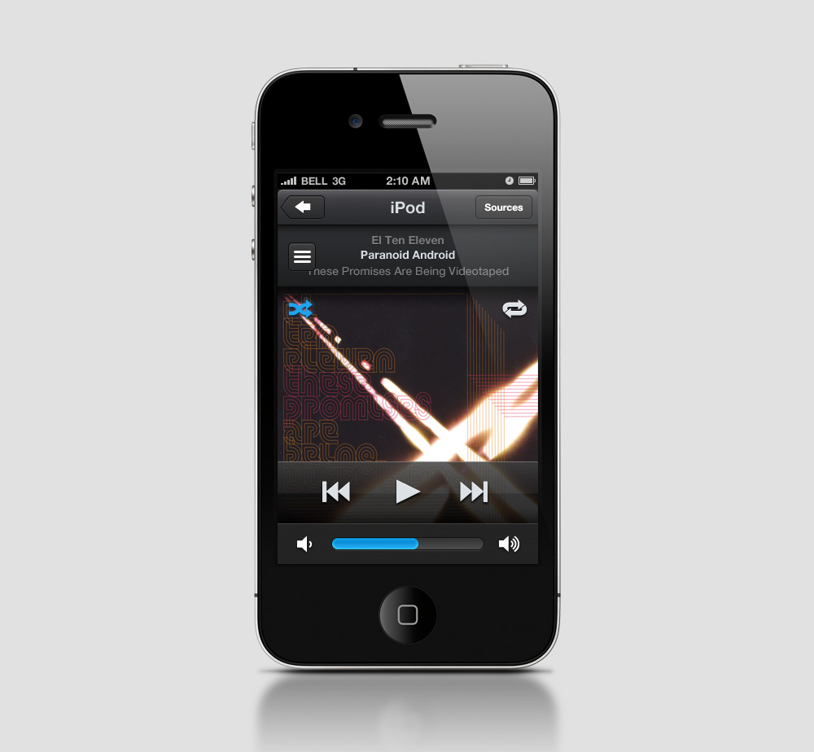
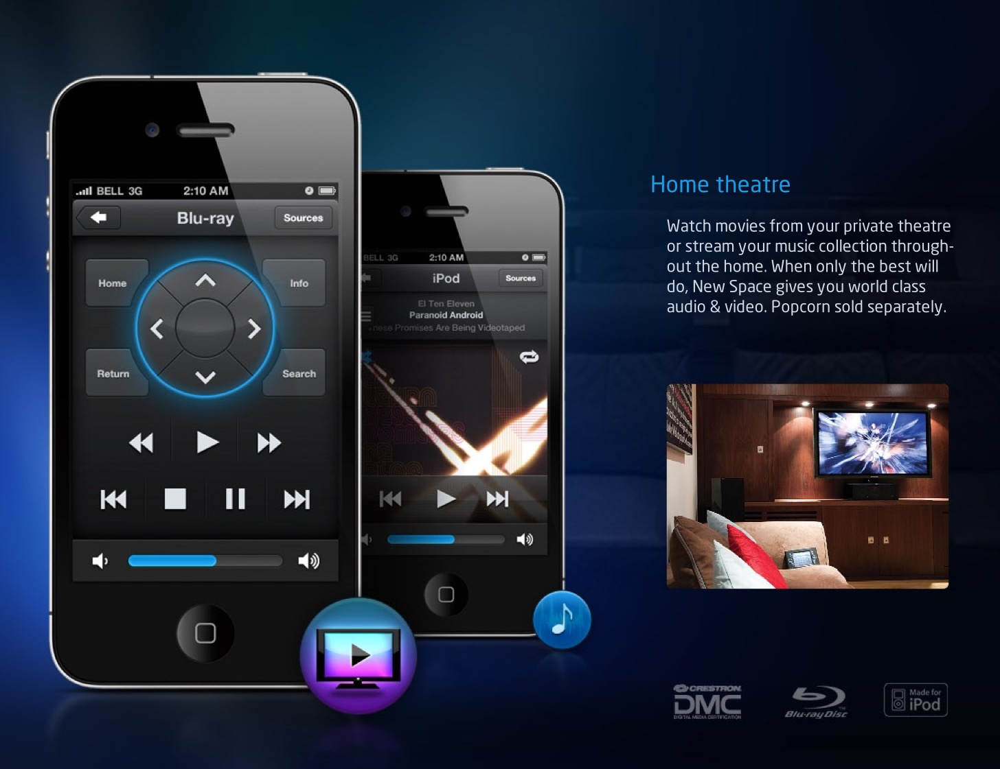
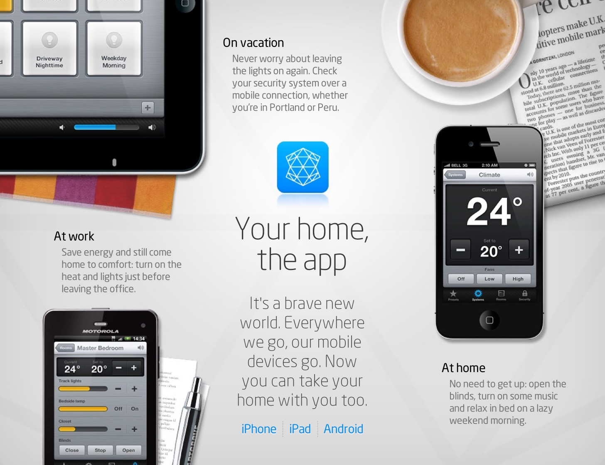
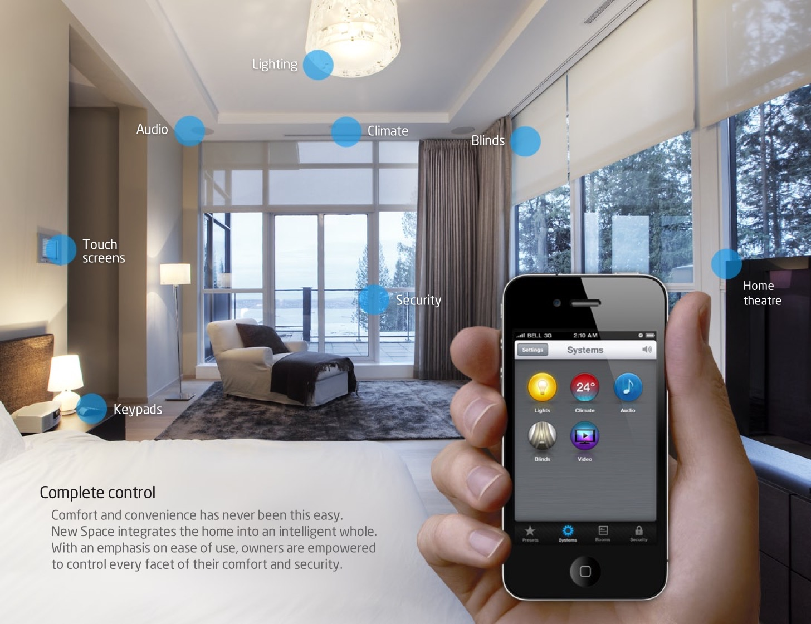
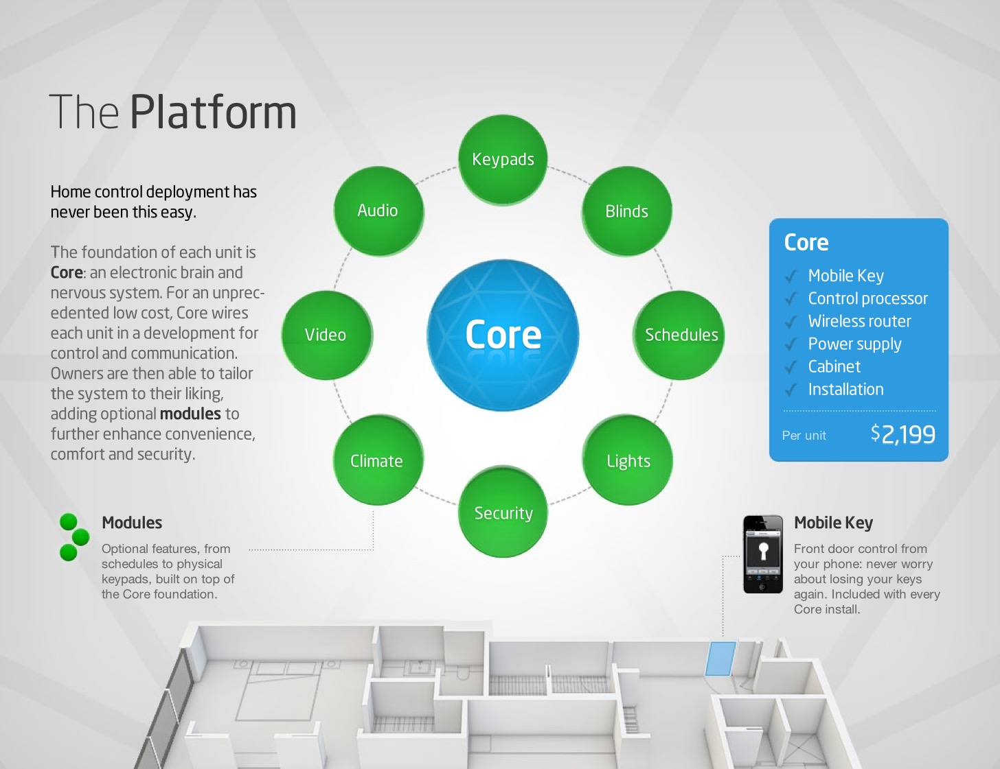
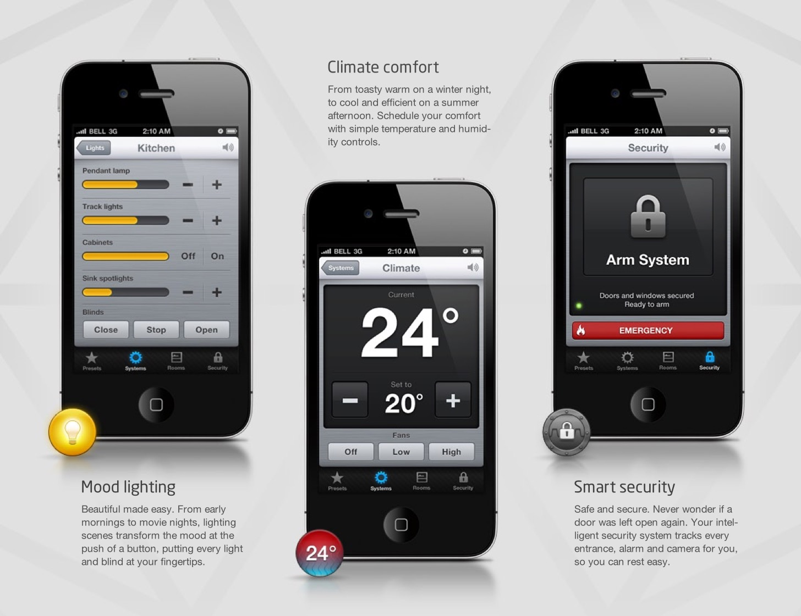

_2010_{.timeframe} – Touch interface for high-end residential control system. At the time, home automation systems were notoriously difficult to use. Our goal was to create a next gen interface that was both intuitive to use and attractive. The finished system ran on [Crestron](https://www.crestron.com/) stack, and was controlled from iOS apps. The skeumorphic icons (pre-iOS7) were a lot of fun to create.

The interface was subsequently packaged as an end-to-end control solution for condos, under the name **New Space Core**. I rebranded the company (logo, website, etc) then created the Core marketing campaign, from copy to collateral design. 

<!--  -->

