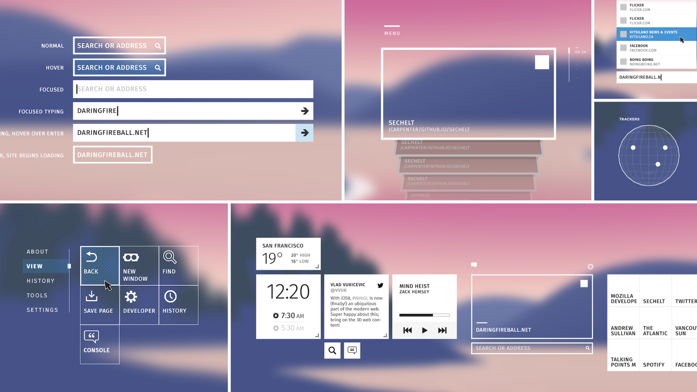
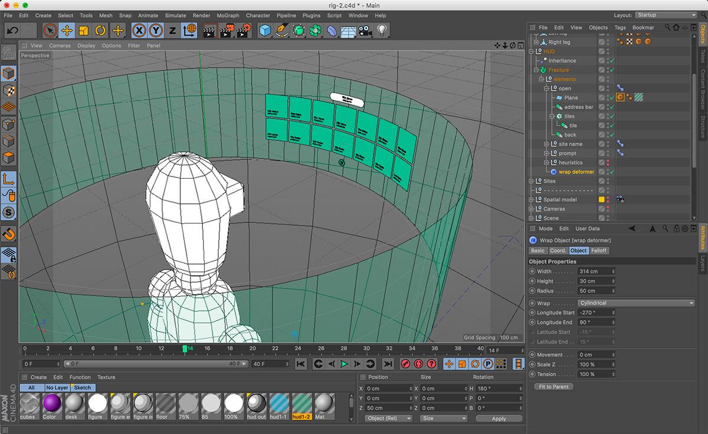
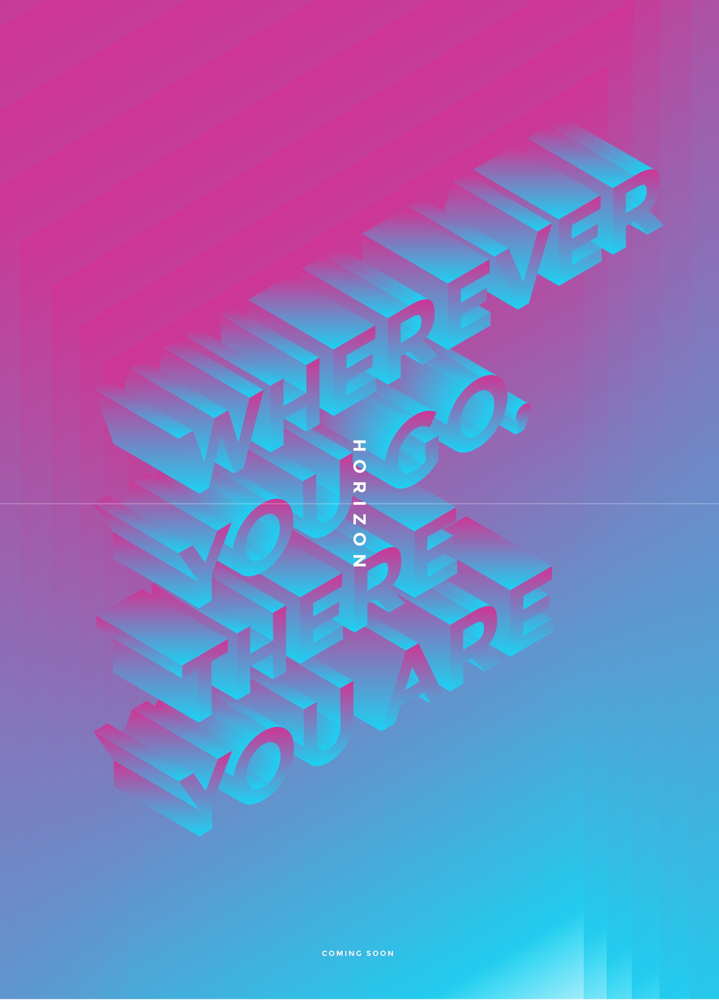

_2014/15_{.timeframe} – The Mozilla VR team was created in 2014 to help bring virtual reality to the open web. I was Product and UX Lead, working with an amazing team of platform engineers^[[Vlad Vukecevic](https://twitter.com/vvuk), creator of WebGL, and [Kip Gilbert](https://twitter.com/kearwoodgilbert)] and front end developers^[[Casey Yee](https://twitter.com/whoyee), [Chris Van Wiemeersch](https://twitter.com/cvanw), [Diego Marcos](https://twitter.com/dmarcos), [Kevin Ngo](https://twitter.com/kevopuff) and [Kevin Grandon](https://twitter.com/Kevining)]. Our job was to help shape future VR WebAPIs by exploring how browsing and web content might work in VR, and to get developers excited about the possibilities. That work eventually led to led the creation of [A-Frame VR](/aframe/).

Our initial focus was prototyping web browsing in virtual reality. We used modified builds of Firefox with experimental features enabled (e.g. an early WebVR API) and interface written in WebGL and HTML/CSS to explore VR versions of classic browsing interactions, such as entering a URL, navigating from site to site, selecting favorites, etc. These prototypes were demoed at events such as [GDC 2015](https://blog.mozilla.org/en/mozilla/bringing-native-games-to-the-web-is-about-to-get-a-whole-lot-easier/), and led helped inform the nascent WebVR API design.

<figure>
        <video playsinline autoplay loop muted>
                <source src="img/mozvr/mozvr-horizon-hud.webm" type="video/webm; codecs=vp9,opus"></source>
                <source src="img/mozvr/mozvr-horizon-hud.mp4" type="video/mp4"></source>
        </video>
        <figcaption>Prototype: Using CSS 3D transforms and a modified version of Firefox to build a menu interface.</figcaption>
</figure>

<figure>
        <video playsinline autoplay loop muted>
                <source src="img/mozvr/mozvr-hiro-loading-concept.webm" type="video/webm; codecs=vp9,opus"></source>
                <source src="img/mozvr/mozvr-hiro-loading-concept.mp4" type="video/mp4"></source>
        </video>
        <figcaption>Concept: a loading indicator appears as the user enters a new site.</figcaption>
</figure>

<figure>
        <video playsinline autoplay loop muted>
                <source src="img/mozvr/mozvr-hiro-prototype-3.webm" type="video/webm; codecs=vp9,opus"></source>
                <source src="img/mozvr/mozvr-hiro-prototype-3.mp4" type="video/mp4"></source>
        </video>
        <figcaption>Prototype: loading a new world (site) from a menu.</figcaption>
</figure>

