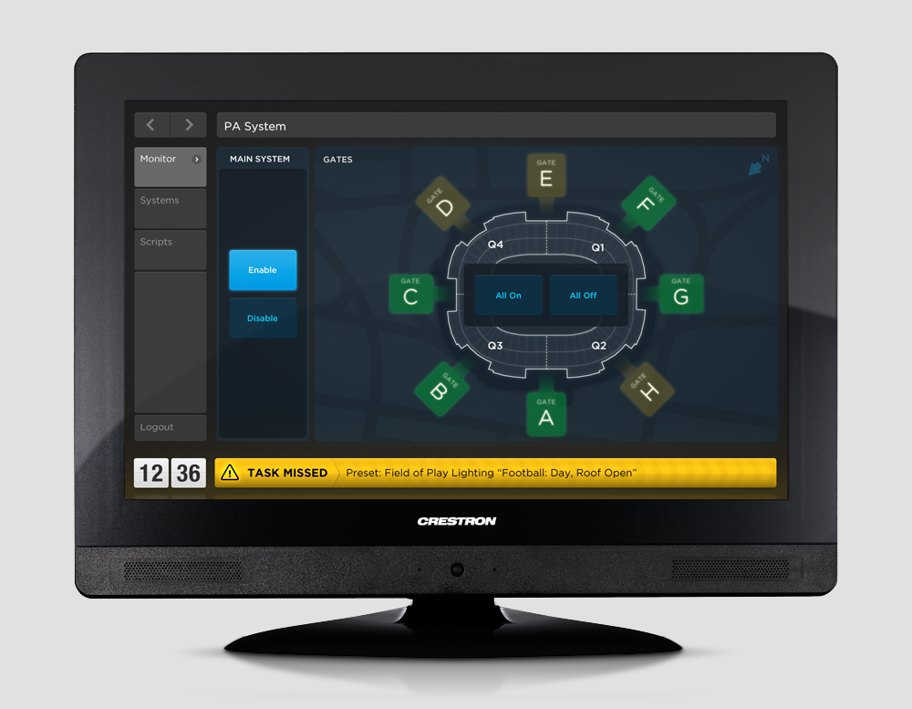
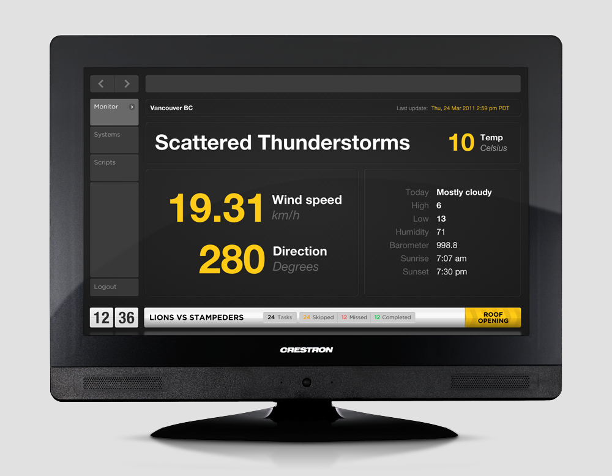
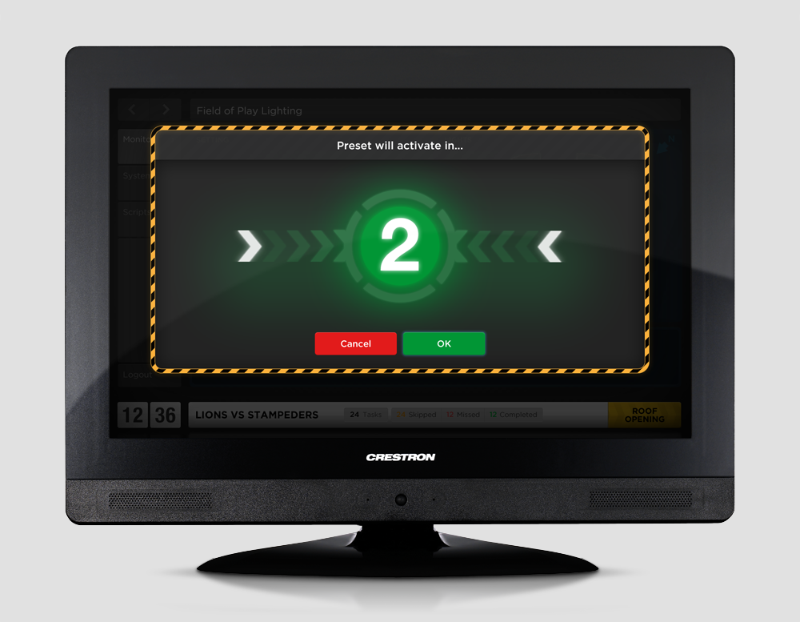
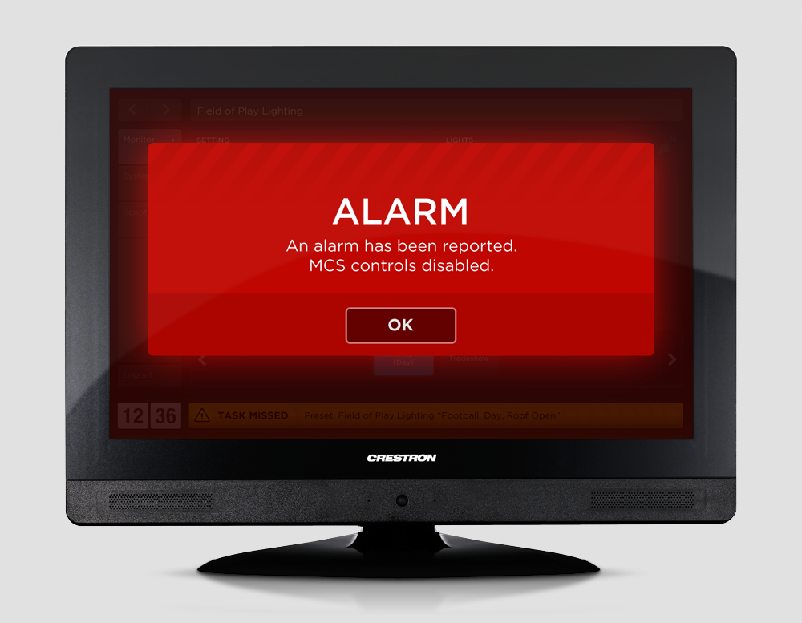
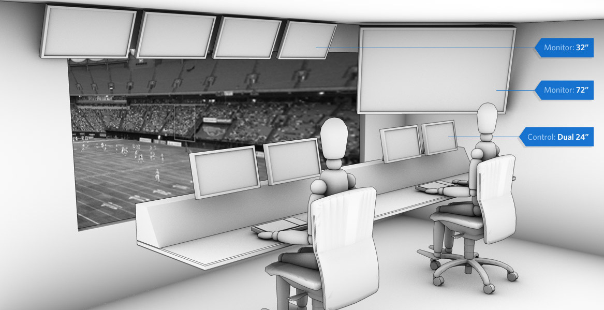
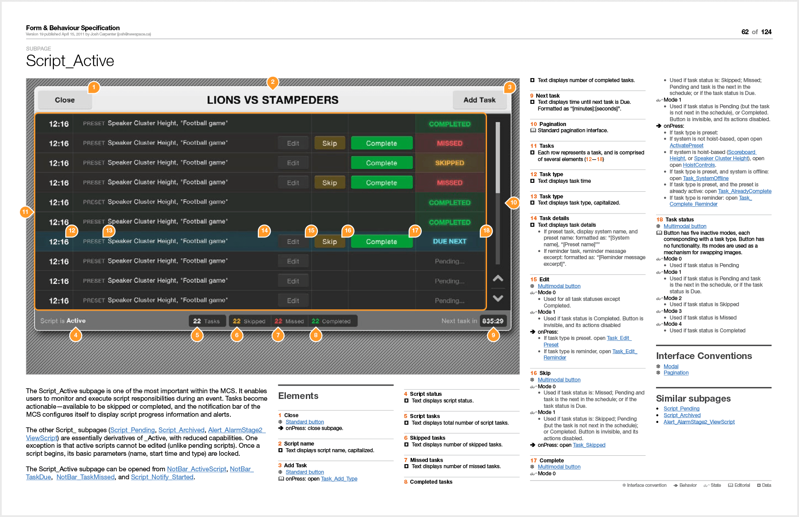

_2011_{.timeframe} – While working at New Space I designed this touch-based control room solution for the monitoring, scheduling and control of Vancouver's largest stadium, BC Place. I was responsible for the end-to-end design process: from project definition with engineering peers and client stakeholders, to prototyping, to visual design, to final interface implementation in a proprietary front end development application from Crestron. Applications used were predominantly Keynote for wireframes and interactive prototypes, Photoshop for visual design and asset production, and InDesign for documentation.

The stadium features a retractable roof which is vulnerable to wind and rainfall during the slow transition between open and closed states. Facility operations staff must make the determination about whether to alter the roof's settings hours in advance, based on incoming weather. This made the weather monitoring interface of the control room critical.

Presets emerged early as a key requirement, enabling operators to easily flip hundreds of mechanical devices (eg: lights, audio systems, signage, etc) between standard configurations.

Life safety issues were a critical design consideration. The stadium contains components that weigh many tons and can be moved between multiple configurations. The roof being the most obvious example, but the massive display suspended above center-field being another. When staff need to modify the screen (to make repairs, for example) it must be lowered via lifts to the field below. This creates obvious life safety risks. The system needed to therefore incorporate safeties against foot guns, including but not limited to confirmation dialogues, countdowns, opportunities to cancel operations, and visual aids.

While the original project charter called only for design and implementation of the software component, we made the case during development for a more holistic approach, taking into consideration the ergonomics and equipment in the space itself, the better to facilitate the worker's tasks. I gathered requirements from stakeholders and proposed various solutions, communicating concepts with the aid of renderings created in Cinema4D.

Upon acceptance of the user experience and work space design, I produced assets in Photoshop, split the interface into modules within Crestron's UI authoring software, and created detailed documentation for the systems engineers who responsible for programming and on-site implementation. The following documentation is perhaps my favorite personal output from the project. Wanting to create something that made the huge volume of detail manageable, I researched various documentation systems and taught myself InDesign so I could produce a modular, hyper-linked final interaction spec.

