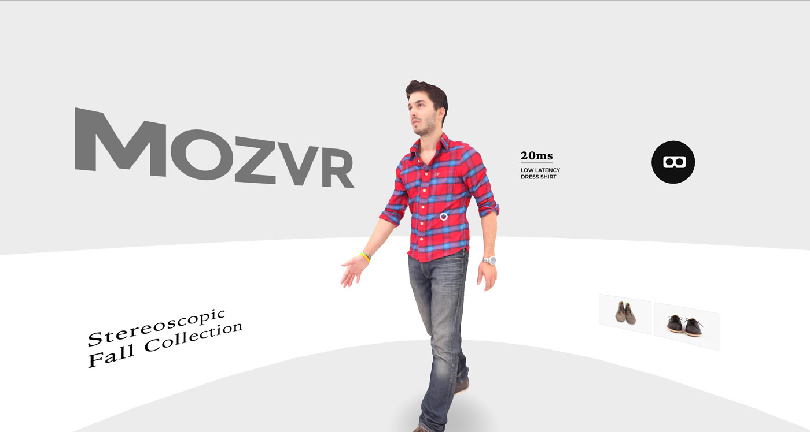
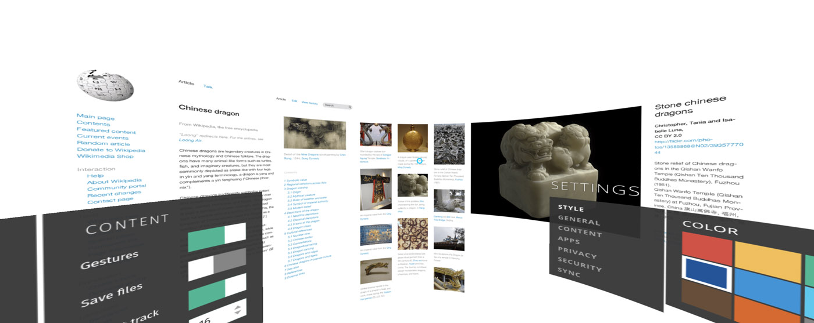
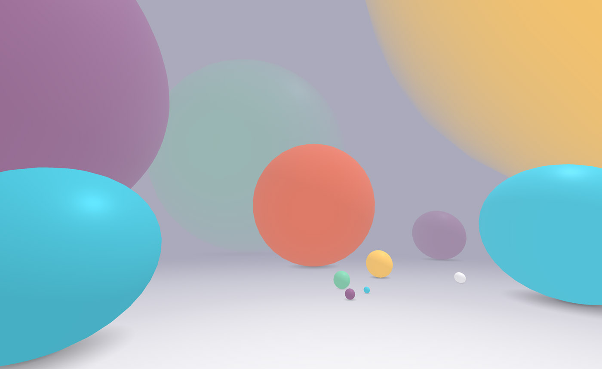
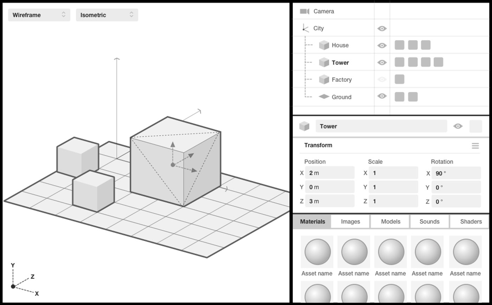
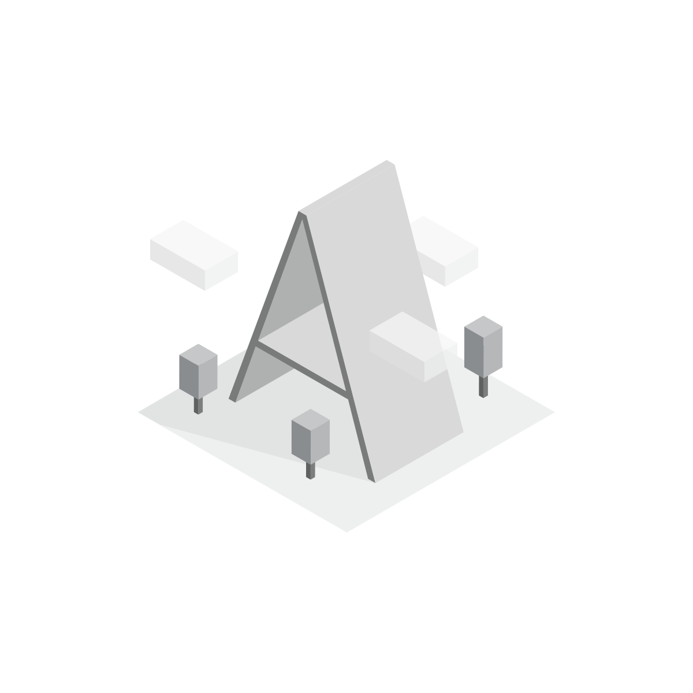
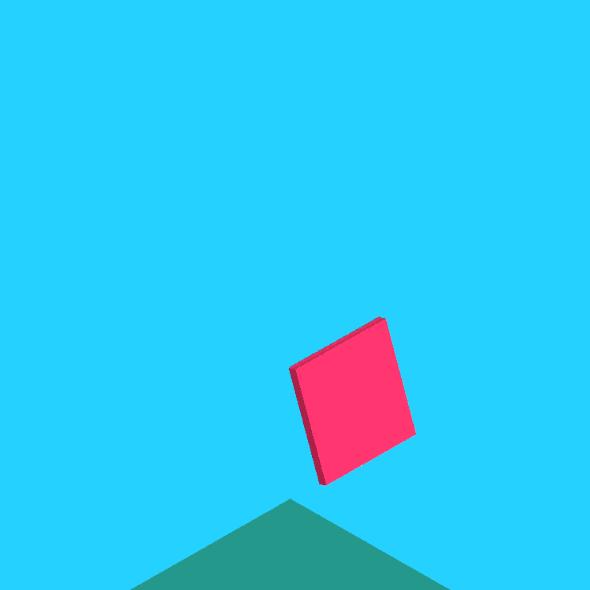

A-Frame is a framework that lets web developers create WebVR experiences without having to know WebGL. It is designed to be extremely easy to pick up, but deep and extensible enough for power users to sink their teeth into. I was product lead and designer on the project, defining value proposition, roadmap, marketing, and example scenes. Visit [aframe.io](https://aframe.io/) for more information.

Markup is wonderful but we anticipate that better creative tools will soon be needed. In the course of A-Frame's development we explored future editor interfaces. The following apes a conventional 3D content creation editor UI with viewports, scene graph, attribute editor and materials list. 

For A-Frame's brand, once we'd settled on the name I sketched various identities before settling on a three dimensional "A". I loved the notion of recreating the original Illustrator image in code and encouraging variations via a channel like the CSS Zen Garden. The GIF below captures my first attempt to animate the logo in A-Frame.

