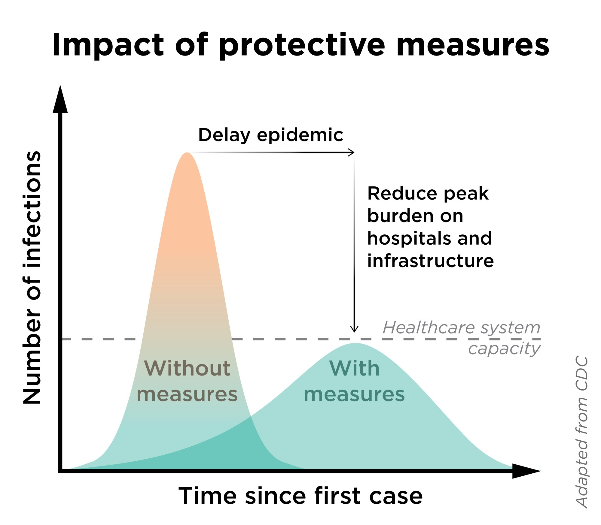
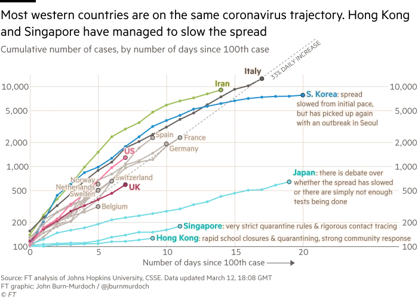

## The wave is coming

[Tweet](https://twitter.com/zeynep/status/1237850255971856389): It's just a little more than two weeks from when Italy had *less* than a hundred confirmed COVID-19 cases, and not only have they imposed severe travel restrictions on the whole country, they just decided to shut down *all* stores except food and pharmacy...

[Tweet](https://twitter.com/jburnmurdoch/status/1237737352879112194): Many western countries may soon face Italy's situation. Case numbers since outbreaks began in several countries have tracked a `~33%` daily rise. This is as true for UK, France, Germany as Italy; the latter is simply further down the path https://ft.com/content/a26fbf7e-48f8-11ea-aeb3-955839e06441

[Tweet](https://twitter.com/LegoSabine101/status/1237839783063244801): Listen to the folks in Italy who are warning us about what's coming if we don't take action. (Contains screenshots from FB post from Italian)

[WaPo](https://www.washingtonpost.com/opinions/2020/03/10/coronavirus-what-matters-isnt-what-you-can-see-what-you-cant/): When a danger is growing exponentially, everything looks fine until it doesn't

> The crisis in northern Italy is what happens when a fast doubling rate meets a "threshold effect," where the character of an event can massively change once its size hits a certain threshold.

> ...the virus is here, and it is spreading quickly, even though everything looks normal. Right now, the United States has more reported cases than Italy had in late February. What matters isn't what you can see but what you can't: the patients who will need ICU care in two to six weeks.

## 30-70% could become infected

-   2/3 Germans could be infected. ==Bennhold, Katrin, & Eddy, Melissa. [Merkel Gives Germans a Hard Truth About the Coronavirus](https://www.nytimes.com/2020/03/11/world/europe/coronavirus-merkel-germany.html). The New York Times. 11 Mar 2020. Retrieved 13 Mar 2020.==
-   30-70% of Canadians. ==Weeks, Carly. [Between 30 and 70 Per Cent of Canadians Could Become Infected with Coronavirus, Patty Hajdu Says](https://www.theglobeandmail.com/canada/article-between-30-and-70-per-cent-of-canadians-could-be-infected-with/). The Globe and Mail. 11 Mar 2020. Retrieved 13 Mar 2020.==
-   40-70% of Americans. ==[UCSF COVID-19 Panel Notes](https://docs.google.com/document/d/1v74KlOuKNgeoKCrN4poZjvzcJq5Lp0HqdLolGoc2OIo/edit?usp=sharing&usp=embed_facebook). Google Docs. 12 Mar 2020. Retrieved 13 Mar 2020.==
-   2/3 is probably worst case. 30-50% more likely. ==Bennhold, Katrin, & Eddy, Melissa. [Merkel Gives Germans a Hard Truth About the Coronavirus](https://www.nytimes.com/2020/03/11/world/europe/coronavirus-merkel-germany.html). The New York Times. 11 Mar 2020. Retrieved 13 Mar 2020.==

## In America, that could translate into 1.6 million dead

-   360 million Americans, 50% infection, 1% mortality = 1.6 million.
-   Note: Italy is seeing more like 6% mortality. But US (I've read) has more ICU beds. But the US is has weaker safety net (i.e. more poor people who can't afford to stay home from work), and does not have socialized health care (some more may avoid treatment).
-   1% fatality rate would be 10x the flu. ==[UCSF COVID-19 Panel Notes](https://docs.google.com/document/d/1v74KlOuKNgeoKCrN4poZjvzcJq5Lp0HqdLolGoc2OIo/edit?usp=sharing&usp=embed_facebook). Google Docs. 12 Mar 2020. Retrieved 13 Mar 2020.==
-   (Assuming no drugs found effective and made available)

## Spread could take several years

-   1-2 years. Maybe longer. ==Bennhold, Katrin, & Eddy, Melissa. [Merkel Gives Germans a Hard Truth About the Coronavirus](https://www.nytimes.com/2020/03/11/world/europe/coronavirus-merkel-germany.html). The New York Times. 11 Mar 2020. Retrieved 13 Mar 2020. Per German virologist.==
-   12-18 months. ==[UCSF COVID-19 Panel Notes](https://docs.google.com/document/d/1v74KlOuKNgeoKCrN4poZjvzcJq5Lp0HqdLolGoc2OIo/edit?usp=sharing&usp=embed_facebook). Google Docs. 12 Mar 2020. Retrieved 13 Mar 2020.==
-   "Our lives are going to look different for the next year". ==[UCSF COVID-19 Panel Notes](https://docs.google.com/document/d/1v74KlOuKNgeoKCrN4poZjvzcJq5Lp0HqdLolGoc2OIo/edit?usp=sharing&usp=embed_facebook). Google Docs. 12 Mar 2020. Retrieved 13 Mar 2020.==
-   It could subside in the summer, but come back strong in the fall. If it's seasonal (we don't yet know). This is what happened with the 1918 Spanish Flu.

## Once enough people have been infected, we get herd immunity

-   Can't catch something if enough people you are already immune (because they've already been sick).

## The primary risk is hospitals being overwhelmed

> ...the threshold is things such as ICU beds. If the epidemic is small enough, doctors can provide respiratory support to the significant fraction of patients who develop complications, and relatively few will die. But once the number of critical patients exceeds the number of ventilators and ICU beds and other critical-care facilities, mortality rates spike.

## Strategy is to flatten the curve

-   Slow the rate at which people are infected...
-   To keep healthcare providers from being swamped (ala Italy)
-   To buy time until treatments can be developed.

## We slow the spread by keeping people apart

Countries that keep people apart are slowing COVID-19 spread. E.g. Signapore, Hong Kong. Countries that are not, are seeing massive outbreaks. E.g. Iran, Italy, China.

Per [Financial Times](https://www.ft.com/content/a26fbf7e-48f8-11ea-aeb3-955839e06441), Mar 12:

Per Globe & Mail:

> Dr. Fisman said evidence shows countries that have adopted policies to keep people apart have been able to control the COVID-19 spread, while others, such as Iran, Italy and China, have faced massive outbreaks because of inaction. ==Weeks, Carly. [Between 30 and 70 Per Cent of Canadians Could Become Infected with Coronavirus, Patty Hajdu Says](https://www.theglobeandmail.com/canada/article-between-30-and-70-per-cent-of-canadians-could-be-infected-with/). The Globe and Mail. 11 Mar 2020. Retrieved 13 Mar 2020.==

### Social distancing keeps people from getting infected

> "Social distancing means remaining out of congregate settings, avoiding mass gatherings, and maintaining distance (approximately 6 feet or 2 meters) from others when possible." ==CDC. [Coronavirus Disease 2019 (COVID-19)](https://www.cdc.gov/coronavirus/2019-ncov/php/risk-assessment.html). Centers for Disease Control and Prevention. 9 Mar 2020. Retrieved 13 Mar 2020.==

### Isolation and quarantine keep sick people from spreading the illness

Per [Vox](https://www.vox.com/2020/3/3/21161232/coronavirus-usa-quarantine-isolation-social-distancing):

-   **Isolation** is separating those with confirmed infections from other people, so that they can get better without infecting anyone else.
-   **Quarantine** is restricting the movement of, or isolating, people who might have been exposed to an infection but who aren't yet sick.

## How can we catch it?

In terms of likelihood (based on podcast TODO: Get link.)

1.  Aerosol transmission
2.  Hand to mouth / face
3.  Fecal oral

Virus lasts 4-20 hrs on surfaces (maybe few days), depending on type. No consensus yet, though. ==[UCSF COVID-19 Panel Notes](https://docs.google.com/document/d/1v74KlOuKNgeoKCrN4poZjvzcJq5Lp0HqdLolGoc2OIo/edit?usp=sharing&usp=embed_facebook). Google Docs. 12 Mar 2020. Retrieved 13 Mar 2020.==

## How long are we infectious?

-   Can be infectious before symptoms appear.
-   "We currently think folks are infectious 2 days before, through 14 days after onset of symptoms (T-2 to T+14 onset)". ==[UCSF COVID-19 Panel Notes](https://docs.google.com/document/d/1v74KlOuKNgeoKCrN4poZjvzcJq5Lp0HqdLolGoc2OIo/edit?usp=sharing&usp=embed_facebook). Google Docs. 12 Mar 2020. Retrieved 13 Mar 2020.==

## What if we get sick?

If you're under 70, and don't have lung or cardio-vascular problems:

-   Stay at home, socially isolate, treat the symptoms.
-   *"There is very little you can do at a hospital that you couldn't do at home. Most cases are mild. But if they are old or have lung or cardio-vascular problems, read on."* ==[UCSF COVID-19 Panel Notes](https://docs.google.com/document/d/1v74KlOuKNgeoKCrN4poZjvzcJq5Lp0HqdLolGoc2OIo/edit?usp=sharing&usp=embed_facebook). Google Docs. 12 Mar 2020. Retrieved 13 Mar 2020.==

If you're 70+, and/or have lung or cardio-vascular problems:

-   Take them to the ER
-   Also do this if: you're having trouble breathing, or fever is very high and unmanaged with meds. TODO: Citation needed.

At the hospital:

-   Covid-19 causes primary pneumonia in a significant number of cases. Requires ICU to survive. Many patients need to stay on mechanical ventilators as long as 4 weeks. ==Gale, Jason. [Coronavirus Patients' Long Ventilator Stays Put Strain on Hospitals](https://www.bloomberg.com/news/articles/2020-02-23/coronavirus-patients-long-ventilator-stays-strain-hospitals). Bloomberg.com. 23 Feb 2020. Retrieved 13 Mar 2020. "More than two-thirds of critically ill patients required invasive breathing support, doctors at the Jin Yintan hospital in the central Chinese city of Wuhan found in a study of 52 such cases at the outbreak's epicenter."==
-   There is no accepted treatment yet.
-   Hospital will give supportive care (IV fluids, oxygen, etc) to help patient stay alive, while their body fights the disease.
-   If someone is high risk (both old, and has lung or cardio issues), they may be able to enroll for compassionate use of Remdesivir, a drug currently in clinical trials at UCSF and in China. ==[UCSF COVID-19 Panel Notes](https://docs.google.com/document/d/1v74KlOuKNgeoKCrN4poZjvzcJq5Lp0HqdLolGoc2OIo/edit?usp=sharing&usp=embed_facebook). Google Docs. 12 Mar 2020. Retrieved 13 Mar 2020.==

## How does testing work?

-   PCR (Polymerase Chain Reaction) test. The only test that can distinguish COVID-19 from other dozen respiratory bugs currently circulating. ==[UCSF COVID-19 Panel Notes](https://docs.google.com/document/d/1v74KlOuKNgeoKCrN4poZjvzcJq5Lp0HqdLolGoc2OIo/edit?usp=sharing&usp=embed_facebook). Google Docs. 12 Mar 2020. Retrieved 13 Mar 2020.==
-   PCR test requires kits, and clinical labs to process those kits. ==[UCSF COVID-19 Panel Notes](https://docs.google.com/document/d/1v74KlOuKNgeoKCrN4poZjvzcJq5Lp0HqdLolGoc2OIo/edit?usp=sharing&usp=embed_facebook). Google Docs. 12 Mar 2020. Retrieved 13 Mar 2020.==
-   Kits are becoming more available, but lab capacity is not growing. ==[UCSF COVID-19 Panel Notes](https://docs.google.com/document/d/1v74KlOuKNgeoKCrN4poZjvzcJq5Lp0HqdLolGoc2OIo/edit?usp=sharing&usp=embed_facebook). Google Docs. 12 Mar 2020. Retrieved 13 Mar 2020.==
-   The leading firms---Quest and Labcore---have 1000 kit/day capacity. For the entire US. ==[UCSF COVID-19 Panel Notes](https://docs.google.com/document/d/1v74KlOuKNgeoKCrN4poZjvzcJq5Lp0HqdLolGoc2OIo/edit?usp=sharing&usp=embed_facebook). Google Docs. 12 Mar 2020. Retrieved 13 Mar 2020.==
-   Universities like UCSF, UCBerkeley and UWashington have donated research labs to help process kits. But capacity is only 20-40 kits/day. ==[UCSF COVID-19 Panel Notes](https://docs.google.com/document/d/1v74KlOuKNgeoKCrN4poZjvzcJq5Lp0HqdLolGoc2OIo/edit?usp=sharing&usp=embed_facebook). Google Docs. 12 Mar 2020. Retrieved 13 Mar 2020.==

## What should we do to prepare?

### Everyone:

-   Stockpile critical prescription meds. Many supply chains run through China. ==[UCSF COVID-19 Panel Notes](https://docs.google.com/document/d/1v74KlOuKNgeoKCrN4poZjvzcJq5Lp0HqdLolGoc2OIo/edit?usp=sharing&usp=embed_facebook). Google Docs. 12 Mar 2020. Retrieved 13 Mar 2020.==

-   Pneumonia shot may be helpful. Doesn't prevent COVID-19, but reduces chance of being weakened, which makes COVID-19 more dangerous. For same reason, get flu shot next fall. ==[UCSF COVID-19 Panel Notes](https://docs.google.com/document/d/1v74KlOuKNgeoKCrN4poZjvzcJq5Lp0HqdLolGoc2OIo/edit?usp=sharing&usp=embed_facebook). Google Docs. 12 Mar 2020. Retrieved 13 Mar 2020.==

-   Buy meds for symptoms. TODO: Citation and additional detail needed.

    -   "You basically just want to prepare as though you know you're going to get a nasty respiratory bug like bronchitis or pneumonia."
    -   Kleenex
    -   Acetominophen (Tylenol) - 350 mg tablets
    -   Ibuprofen (Advil) - 200 mg tablets
    -   Mucinex
    -   Cough medicine. E.g. Robitussin, DayQuil/NyQuil.
    -   Humidifer (can also turn on hot shower and sit in bathroom, or make pot of steaming water).
    -   Thermometer

### Elderly

> We at UCSF are moving our 'at risk' parents back from nursing homes, etc, to their own homes. Then are not letting them out of the house. The other members of the family are washing hands the moment they come in. ==[UCSF COVID-19 Panel Notes](https://docs.google.com/document/d/1v74KlOuKNgeoKCrN4poZjvzcJq5Lp0HqdLolGoc2OIo/edit?usp=sharing&usp=embed_facebook). Google Docs. 12 Mar 2020. Retrieved 13 Mar 2020.==

::: #references

## Referenced works

* Bennhold, Katrin, & Eddy, Melissa. [Merkel Gives Germans a Hard Truth About the Coronavirus](https://www.nytimes.com/2020/03/11/world/europe/coronavirus-merkel-germany.html). The New York Times. 11 Mar 2020. {.reference}

* CDC. [Coronavirus Disease 2019 (COVID-19)](https://www.cdc.gov/coronavirus/2019-ncov/php/risk-assessment.html). Centers for Disease Control and Prevention. 9 Mar 2020. {.reference}

* Gale, Jason. [Coronavirus Patients' Long Ventilator Stays Put Strain on Hospitals](https://www.bloomberg.com/news/articles/2020-02-23/coronavirus-patients-long-ventilator-stays-strain-hospitals). Bloomberg.com. 23 Feb 2020. {.reference}

* Weeks, Carly. [Between 30 and 70 Per Cent of Canadians Could Become Infected with Coronavirus, Patty Hajdu Says](https://www.theglobeandmail.com/canada/article-between-30-and-70-per-cent-of-canadians-could-be-infected-with/). The Globe and Mail. 11 Mar 2020. {.reference}

* [UCSF COVID-19 Panel Notes](https://docs.google.com/document/d/1v74KlOuKNgeoKCrN4poZjvzcJq5Lp0HqdLolGoc2OIo/edit?usp=sharing&usp=embed_facebook). Google Docs. 12 Mar 2020. {.reference}
:::
