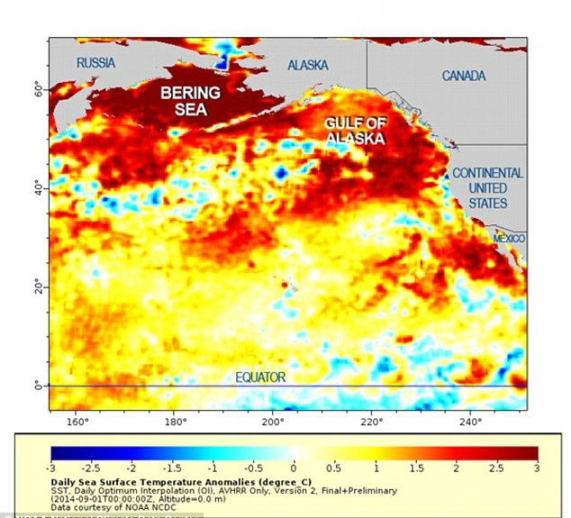
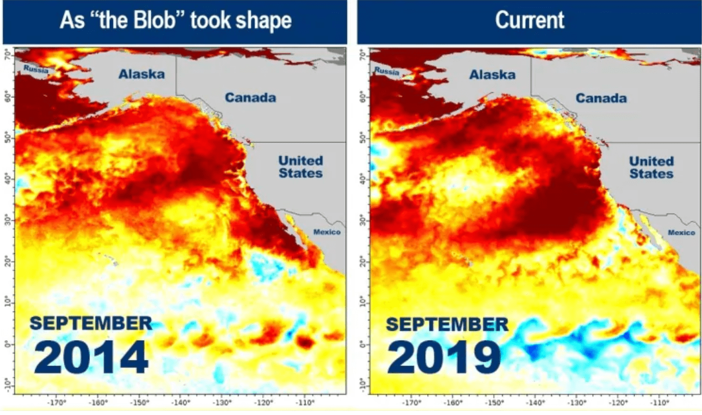

TODO: Grab stats from "Canada's Marine Coasts in a Changing Climate".

## Fisheries declines

TODO: Flesh this out further. All I have is the following article on economic impacts on commercial fisherman in 2019.

The federal government cites climate change as the primary cause of declines in ocean fisheries. In 2019 the returns were so bad for some species and regions that commercial fisherman requested government relief: ==Chan, Cheryl. <a href='https://vancouversun.com/business/local-business/advocates-sound-alarm-on-unfolding-disaster-in-b-c-salmon-fishing-industry'>Unfolding Disaster in B.C. Salmon Fishing Industry Has Hit Workers Hard</a>. The Vancouver Sun. 10 Sep 2019. Retrieved 5 Oct 2019.==

> On Monday, First Nation and union leaders said the federal and provincial governments need to step in to help fishermen through the worst commercial fishing season in 50 years as runs have plummeted for all species and in all regions.

> "The impacts of this climate change disaster has been coast wide," Joy Thorkelson, president of the United Fishermen and Allied Workers' Union, said at a press conference in New Westminster.

> Thorkelson says at least 2,500 people have been affected by the downturn. ==<a href='https://www.ipcc.ch/srocc/home/'>The Ocean and Cryosphere in a Changing Climate</a>. Geneva, Switzerland: IPCC. 25 Sep 2019.==

> She shared stories from union members who had called her office asking for help, including a fisherman whose catch can't cover fuel and provision costs and a shore worker who told her she has to look into school breakfast and lunch programs because she can only afford to provide one meal for her child.

> Many of the workers haven't earned money since last year's salmon season, she said, calling the situation "a huge crisis."

> "People need disaster relief now," she said. "We need to talk to the government about what climate change adaptation is going to look like for the commercial industry in the future, but we need something to keep the bodies and souls of those people together.

> "If those traditional foods are being threatened because of global warming," he said, then the government is "further compounding the impoverishment of some marginalized people."

> John Helin, former gillnetter and current mayor of Lax Kw'alaams, says the lack in salmon has put pressure on other species of fish and there's been a decline in their numbers.

### Whales dying

See "The Blob" case study below for details.

## Case study: The Blob

[Wikipedia](https://en.wikipedia.org/wiki/The_Blob_(Pacific_Ocean)). A huge mass of warm water that lingered in the Pacific off the coast of North America from late 2013 to 2016. Temperatures peaked at 3.9°C above average. May in turn have contributed to severe drought in California. Similar conditions have re-emerged as of September 2019. ==Freedman, Andrew, & Tierney, Lauren. <a href='https://www.washingtonpost.com/weather/2019/09/21/blob-is-surging-back-pacific-leading-fears-mass-die-offs-marine-life-unusual-weather-patterns/'>The "Blob" Is Surging Back in the Pacific, Leading to Fears of Mass Die-Offs of Marine Life and Unusual Weather Patterns</a>. Washington Post. 2019-09-21T08:00-500. Retrieved 7 Nov 2019.==

Caused by a persistent static high pressure ridge (dubbed the [Ridiculously Resilient Ridge](https://en.wikipedia.org/wiki/Ridiculously_Resilient_Ridge)) in the atmosphere, which resulted in a lack of wind. Winds that would otherwise drive oceanic heat dissipation through wind-driven currents and surface waves.

Scientists attributed a coincident ++I'm unsure how strongly to attribute the toxic algal bloom to the marine heat wave++ toxic algal bloom to the deaths of 30 whales washed up on the coast of BC and Alaska, and to mass die offs of marine mammals in California

> "\[A\] number of studies suggested long-term ocean warming due to climate change made the heat wave stronger than it otherwise would have been." ==Schmunk, Rhianna. <a href='https://www.cbc.ca/news/canada/british-columbia/marine-heatwave-2019-the-blob-1.5271870'>Scientists Monitoring New Marine Heat Wave Off B.C. Coast Similar to "the Blob"</a>. 5 Sep 2019. Retrieved 7 Nov 2019.==

## Acidification could wipe out the shellfish industry

The *Preliminary Strategic Climate Risk Assessment for BC* report explores a scenario of 0.15 pH reduction along the BC coast by 2050, relative to 1990-2010 levels. Their take aways:

> "Shellfish and other marine life are particularly vulnerable to ocean acidification and are already showing signs of distress. By 2050, shellfish and other marine life could experience significant impacts, such as decreased classification for scallop, oyster, clam, limpet, periwinkle, and whelk. In addition, acidification can alter critical behaviours and chemical reactions in the bodies of fish that may affect their ability to survive. While these species may not be lost entirely, they will be **weakened permanently and likely unable to recover** if ocean acidification persists." ==Ministry of Environment and Climate Change Strategy. <a href='https://www2.gov.bc.ca/gov/content/environment/climate-change/adaptation/risk-%20assessment'>Preliminary Strategic Climate Risk Assessment for British Columbia</a>. Victoria, BC: Government of British Columbia. 2019.==

> "...direct and indirect economic losses could total more than \$100 million" ==Ministry of Environment and Climate Change Strategy. <a href='https://www2.gov.bc.ca/gov/content/environment/climate-change/adaptation/risk-%20assessment'>Preliminary Strategic Climate Risk Assessment for British Columbia</a>. Victoria, BC: Government of British Columbia. 2019.==

> "\[Costs\] to government could include lost revenue and taxes as well as resources or programs to help the shellfish industry cope with acidification. These costs are expected to be on the order of \$375 million or less." ==Ministry of Environment and Climate Change Strategy. <a href='https://www2.gov.bc.ca/gov/content/environment/climate-change/adaptation/risk-%20assessment'>Preliminary Strategic Climate Risk Assessment for British Columbia</a>. Victoria, BC: Government of British Columbia. 2019.==

## New species could move north into BC waters

Per the 2019 IPCC Ocean and Cryosphere report:

> "Evidence from recent studies on projected climate risks on recreational fishing is equivocal, with the direction of impacts depending on the location, /species targeted and societal context. For example: poleward range shifts of marine fish (Section 5.2.3) could yield new opportunities for recreational fishing in mid- to high latitude regions (DiSegni and Shechter, 2013); projected increases in air temperature may enable longer fishing days in some area (Dundas and von Haefen, 2015); and extreme events may alter the composition of recreational fishing catches (Santos et al., 2016). Since climate risks to recreational fishing vary largely depending on the responses of the targeted species to climate-related pressures, there is low confidence in the overall risk to the activity." ==<a href='https://www.ipcc.ch/srocc/home/'>The Ocean and Cryosphere in a Changing Climate</a>. Geneva, Switzerland: IPCC. 25 Sep 2019.==
