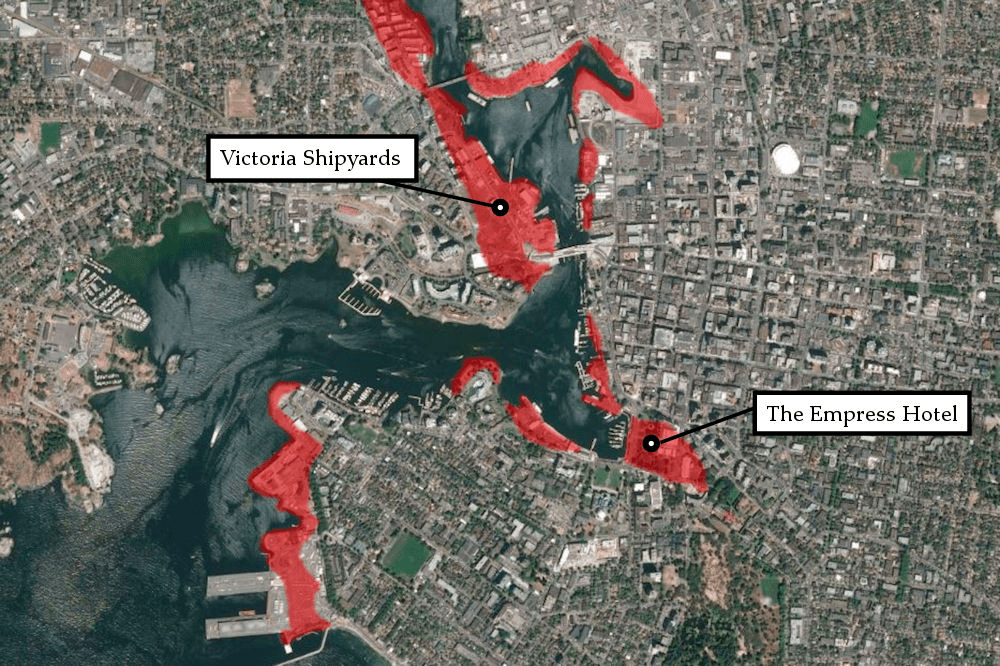
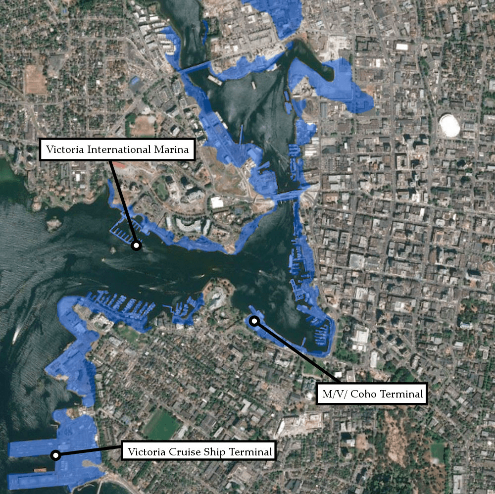
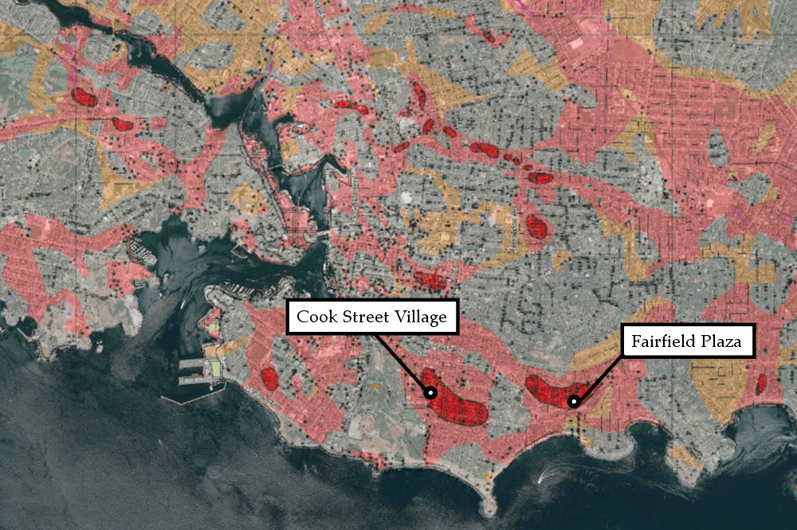
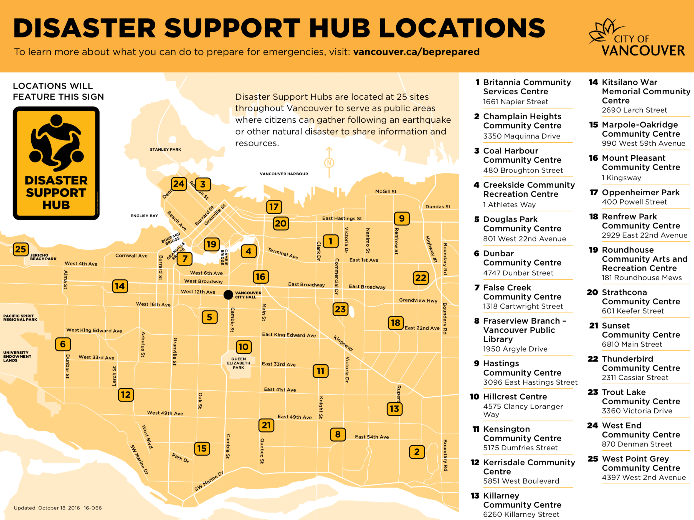
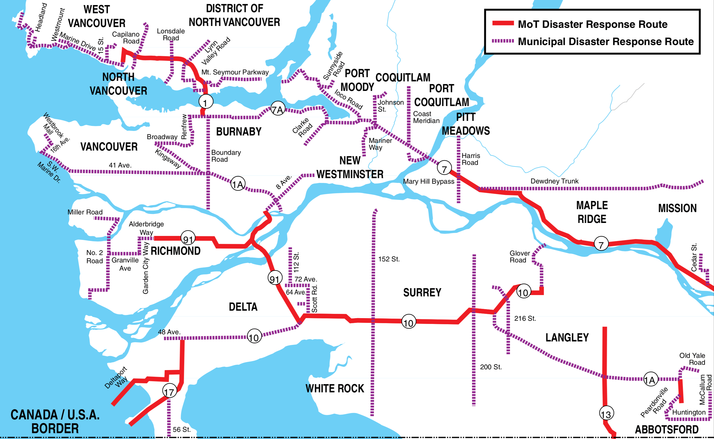
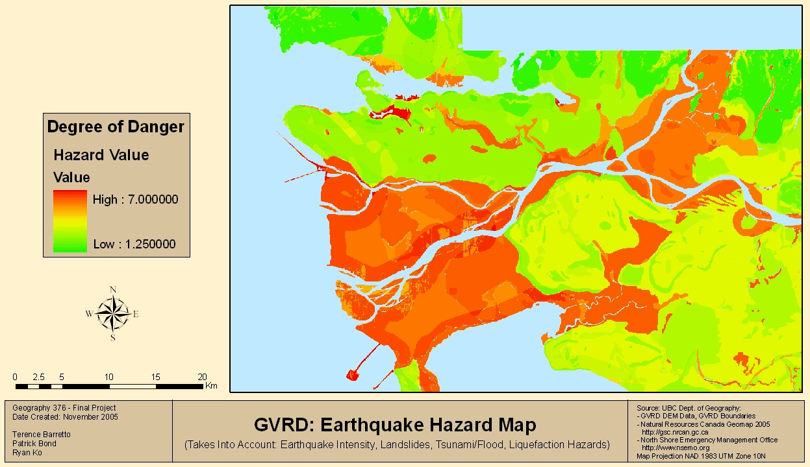

As we consider the impact and response to climate change in British Columbia, it is useful to review the province's earthquake preparedness plans. For example: Vancouver's Disaster Support Hubs could be just as helpful to refugees from a massive forest fire as they would be to evacuees from earthquake-damaged buildings. And the impact of climate change will, over time, be equivalent (or greater) to the expected Big One quake, and strike in similar ways.

## Two types of quakes

### Subduction

One continental plate slipping under another in the Cascadia subduction zone, off west coast. Subduction quakes occur relatively deep (80 to 45km) along subduction zones and therefore effect larger areas. They are experienced as rolling waves, to the degree that people report sea sickness symptoms. The duration of the quake corresponds with its intensity. For example, 4 minutes = 9.0 magnitude. We can create early warning systems for them (see section later in doc).

### Crustal

Occur relatively shallow (35km) at faults inside the crust, and therefore effect a relatively small area, close to the epicenter. Duration is shorter (e.g. strong shaking for 20-60 seconds). Initial hit feels like a truck has slammed into your building. "Small shallow earthquakes occur every day in Cascadia; damaging quakes occur every few decades" ==[Where Do Earthquakes Come From](https://crew.org/earthquake-information/where-do-earthquakes-come-from/){.ref-title title=Title}. [CREW]{.ref-container title=Website}. [6 Apr 2016]{.ref-issued title=Issued}. [Retrieved 8 Nov 2019]{.ref-accessed title=Accessed}.== . Christchurch 2010/2011 quakes were crustal.

## Probability

Should expect both a Crustal and Subduction quake to hit within the next 50 years. And for both to be equally destructive. ==[Ripples in a Pond](https://podcast-a.akamaihd.net/mp3/podcasts/faultlines_20161011_32707.mp3){.ref-title title=Title}==

In the next 50 years, for a Cascadia subduction zone quake: ==[Schulz, Kathryn]{.ref-author title=Authors}. [The Really Big One](https://www.newyorker.com/magazine/2015/07/20/the-really-big-one){.ref-title title=Title}. [13 Jul 2015]{.ref-issued title=Issued}. [Retrieved 8 Nov 2019]{.ref-accessed title=Accessed}.==

-   A "big one" (8.0-8.6): **1 in 3**
-   A "very big one" (8.7-9.2): **1 in 10**

We're overdue:

> ...we now know that the Pacific Northwest has experienced forty-one subduction-zone earthquakes in the past ten thousand years. If you divide ten thousand by forty-one, you get two hundred and forty-three, which is Cascadia's recurrence interval: the average amount of time that elapses between earthquakes. That timespan is dangerous both because it is too long---long enough for us to unwittingly build an entire civilization on top of our continent's worst fault line---and because it is not long enough. Counting from the earthquake of 1700, **we are now 315 years into a 243 year cycle**. ==[Schulz, Kathryn]{.ref-author title=Authors}. [The Really Big One](https://www.newyorker.com/magazine/2015/07/20/the-really-big-one){.ref-title title=Title}. [13 Jul 2015]{.ref-issued title=Issued}. [Retrieved 8 Nov 2019]{.ref-accessed title=Accessed}.==

## Immediate impact

### First 24 hours

-   Many buildings not safe to be in (aftershocks could collapse).
-   Water, sewer, power, all out.
-   No gas for vehicles (pumps don't work without electricity).
-   First responders: trying to figure out the scale of the damage. Only most acute needs will be prioritized. Most people will have to have to look after themselves---for first 72 hours especially.
-   Massive amounts of broken glass in downtown.
-   Seattle probably also effected, so help won't come from them.
-   Second-order disasters are major issue: Mudslides, fires, flooding, pipe failures, dam breaches, hazardous-material spills, etc.
-   Infrastructure massively damaged:
    -   Bridges: some are expected to survive, but even then onramps may be too damaged to access the bridge.
    -   Landslides a major risk for critical resupply highways, rail lines, etc.
    -   YVR runways too buckled to land on, although control tower is fine (has been built to "post disaster standards"). Resupply planes could land at Abbotsford instead.
    -   Ports: at risk for tsunamis and liquifaction.
-   Families and individuals should follow their emergency plans.
-   Disaster Support Hubs (see section below) provide rally point to meet up with family, friends and neighbors. And share information.

### After 72 hours

-   Rescue shifts to recovery (bodies).
-   Temp services (portable showers, toilets, etc) and lodging (community centers, gyms, churches, etc) starting to become available.
-   Focus
-   Reuniting families
-   Remote communities still cut off (for weeks possibly). E.g. Tofino, Port Alberni. Help will take time to reach them. Because they're remote, and access routes will be damaged. Ports and airports damaged, highways washed out.
-   External first responders (e.g. Red Cross) starting to arrive and contribute. Local authorities direct these teams.
-   Starting to send visitors (tourists etc) home. But the process take weeks.
-   Disaster Support Hubs (see section below) start to provide: group lodging and shelter; distribution of food, water, and supplies; recovery information; and reuniting families.

### Following months and years

-   Aftershocks can continue to 6-12 months after the initial quake. In Christchurch, the devastating 2011 quake was actually an aftershock to an initial quake 6 months prior.
-   Ongoing evaluation of building safety (tagging green, yellow or red).
-   Displaced people could number in tens of thousands. Perry Adebar (UBC, Structural Engineer) estimates as many as 100,000 homeless in the Lower Mainland area alone. Gradually they move from temp lodging to slightly more robust places (e.g. trailers). Should not resettle buildings unless green tagged (see below). Red are torn down, and yellow repaired. But repairs take ages because of sheer amount of buildings that need attention.
-   BC/Yukon division of Red Cross shift to community building, acting in a support capacity, to aid whatever local needs are.
-   1-3 months to restore electricity?
-   1-12 months to restore drinking water?
-   6 months to restore highways?

> OSSPAC estimates that in the I-5 corridor it will take between one and three months after the earthquake to restore electricity, a month to a year to restore drinking water and sewer service, six months to a year to restore major highways, and eighteen months to restore health-care facilities. On the coast, those numbers go up. Whoever chooses or has no choice but to stay there will spend three to six months without electricity, one to three years without drinking water and sewage systems, and three or more years without hospitals. ==[Schulz, Kathryn]{.ref-author title=Authors}. [The Really Big One](https://www.newyorker.com/magazine/2015/07/20/the-really-big-one){.ref-title title=Title}. [13 Jul 2015]{.ref-issued title=Issued}. [Retrieved 8 Nov 2019]{.ref-accessed title=Accessed}.==

### Long term

> The economy of the Pacific Northwest will collapse. Crippled by a lack of basic services, businesses will fail or move away. Many residents will flee as well. OSSPAC predicts a mass-displacement event and a long-term population downturn. ==[Schulz, Kathryn]{.ref-author title=Authors}. [The Really Big One](https://www.newyorker.com/magazine/2015/07/20/the-really-big-one){.ref-title title=Title}. [13 Jul 2015]{.ref-issued title=Issued}. [Retrieved 8 Nov 2019]{.ref-accessed title=Accessed}.==

Graham Taylor's (seismic engineer) estimates for Vancouver:

-   \$100 billion economic loss
-   2-3k killed
-   100k displaced
-   3-4 decades to recover.

Fukushima, for comparison:

-   \$220 billion
-   +18k killed

## Christchurch earthquakes are best precedents for Lower Mainland:

> "Every engineer tells us the same thing: 'Look at what happened to Christchurch. And expect the same here'." ==[Ripples in a Pond](https://podcast-a.akamaihd.net/mp3/podcasts/faultlines_20161011_32707.mp3){.ref-title title=Title}==

Similar soil conditions, building codes, materials, construction techniques, etc. But Metro Vancouver is **7x population** of Christchurch, and and **20x more dense**. Estimated 50 years to fully recover.

## Buildings

Building codes are written so people survive (the buildings stay standing). But the buildings afterwards will be unusable. Perhaps never able to reenter. Closer to the city the earthquake, the worse off that we'll be. Aftershocks are particularly dangerous. Buildings designed not to collapse from an initial quake. But then they're weakened, and can collapse from aftershocks. Or, as in the case of Onagawa, Japan after the 2011 quake, wave inundation. ==[Ministry of Environment and Climate Change Strategy]{.ref-author title=Authors}. [Preliminary Strategic Climate Risk Assessment for British Columbia](https://www2.gov.bc.ca/gov/content/environment/climate-change/adaptation/risk-%20assessment){.ref-title title=Title}. [Victoria, BC: Government of British Columbia]{.ref-publisher title=Publisher}. [2019]{.ref-issued title=Issued}.== Which is one of the reasons people are not allowed to return unless building is green-tagged.

After quake, engineers will inspect buildings and apply green, yellow or red tags. But it will take time due to volume of buildings relative to number of trained engineers, and they'll err on the side of caution.

Christchurch:

-   Before quake, had 3000 buildings downtown.
-   45% were yellow or red tagged.
-   1240 had been torn down by by 2015 (4 years after the 2011 quake). ==[1240 Central Christchurch Buildings Demolished](https://www.stuff.co.nz/the-press/news/christchurch-earthquake-2011/66290638/1240-central-christchurch-buildings-demolished){.ref-title title=Title}. [Stuff]{.ref-container title=Website}. [20 Feb 2015]{.ref-issued title=Issued}. [Retrieved 8 Nov 2019]{.ref-accessed title=Accessed}.==
-   Downtown was no-go zone for 900 days.

Older buildings are prone to being thrust off their foundations. Solution is to bolt house to foundation. Costs around \$3500. ==[Hopper, Tristin]{.ref-author title=Authors}. [The Most Doomed City in Canada](https://capnews.ca/canada-earthquake-victoria-big-one/){.ref-title title=Title}. [The Capital]{.ref-container title=Website}. [11 Sep 2019]{.ref-issued title=Issued}. [Retrieved 5 Oct 2019]{.ref-accessed title=Accessed}.==

Risk of gas leaks can be reduced by installing "California valves", which shut off gas line if heavy shaking is detected. ==[Hopper, Tristin]{.ref-author title=Authors}. [The Most Doomed City in Canada](https://capnews.ca/canada-earthquake-victoria-big-one/){.ref-title title=Title}. [The Capital]{.ref-container title=Website}. [11 Sep 2019]{.ref-issued title=Issued}. [Retrieved 5 Oct 2019]{.ref-accessed title=Accessed}.==

## Vancouver

Most single family homes will be fine.

West End concrete 60s/70s towers are high risk, and cited by engineers as possibly collapsing. Old brick buildings (e.g. in Gastown and Yaletown) are also extremely prone to exterior wall collapse. Killed lots of people in Christchurch. The walls come down almost immediately.

But modern buildings are not necessarily more robust. Many modern buildings were severely damaged in the 8.8 magnitude 2009 Chilean earthquake. They used 6" concrete walls, per Chilean (and Canadian) building codes. These thinner walls have become popular because they allow for more parking in underground parkades. But they failed in the Chilean earthquake. And a Vancouver subduction quake could be more severe, because our subduction zone is longer.

## Victoria

Extremely vulnerable: ==[Hopper, Tristin]{.ref-author title=Authors}. [The Most Doomed City in Canada](https://capnews.ca/canada-earthquake-victoria-big-one/){.ref-title title=Title}. [The Capital]{.ref-container title=Website}. [11 Sep 2019]{.ref-issued title=Issued}. [Retrieved 5 Oct 2019]{.ref-accessed title=Accessed}.==

-   +85% of buildings predate seismic construction standards.
-   +65% buildings could be red tagged.
-   Most vulnerable areas are centers of commerce and tourism. E.g. Market Square, Chinatown, Bastion Square.
-   Parliament Buildings are one of the most seismically vulnerable structures in the province.
-   Sewage system is mostly brittle pre-WW2 materials (e.g. clay) and could be 95% broken (worst case scenario).
-   Ferry terminals (e.g. Swartz Bay) are built on extremely vulnerable fill land, and in tsunami zones. One estimate says all by one Swartz Bay berth would be destroyed.
-   Fires: Much of Victoria is wooden heritage homes with outdated wiring and no sprinklers.

Many single family homes are built on sandy soil conditions, similar to Christchurch. During a quake, the base of foundations moves, but the house above does not, and the basement collapses. Estimate is: 70-80% of Victoria's housing stock disappears.

## Washington and Oregon

Tidal wave could wipe out everything "west of I5", and render it almost permanently crippled. 30,000 landslides in Seattle, according to their emergency-management office. ==[Schulz, Kathryn]{.ref-author title=Authors}. [The Really Big One](https://www.newyorker.com/magazine/2015/07/20/the-really-big-one){.ref-title title=Title}. [13 Jul 2015]{.ref-issued title=Issued}. [Retrieved 8 Nov 2019]{.ref-accessed title=Accessed}.== 15% of Seattle is built on liquefiable land. Including seventeen day-care centers and the homes of 34.5k people. ==[Schulz, Kathryn]{.ref-author title=Authors}. [The Really Big One](https://www.newyorker.com/magazine/2015/07/20/the-really-big-one){.ref-title title=Title}. [13 Jul 2015]{.ref-issued title=Issued}. [Retrieved 8 Nov 2019]{.ref-accessed title=Accessed}.==

> FEMA calculates that, across \[Cascadia\], something on the order of a million buildings---more than three thousand of them schools---will collapse or be compromised in the earthquake. So will half of all highway bridges, fifteen of the seventeen bridges spanning Portland's two rivers, and two-thirds of railways and airports; also, one-third of all fire stations, half of all police stations, and two-thirds of all hospitals. ==[Schulz, Kathryn]{.ref-author title=Authors}. [The Really Big One](https://www.newyorker.com/magazine/2015/07/20/the-really-big-one){.ref-title title=Title}. [13 Jul 2015]{.ref-issued title=Issued}. [Retrieved 8 Nov 2019]{.ref-accessed title=Accessed}.==

## Ferries

> A major earthquake would destroy almost all berths on B.C. Ferries' major routes, cutting off vital supply lines to Vancouver Island, an engineer and former metal fabricator warn.

> Ray Hebden and Greg Ramsay say only Swartz Bay's Berth 2, a floating 180 metre long concrete pontoon connected to land by a ramp, would withstand a magnitude-9 quake. ==[Smart, Amy]{.ref-author title=Authors}. [Major Quake Would Destroy B.C. Ferries Berths, Experts Warn](http://www.timescolonist.com/news/local/major-quake-would-destroy-b-c-ferries-berths-experts-warn-1.12165845){.ref-title title=Title}. [Times Colonist]{.ref-container title=Newspaper}. [18 Mar 2017]{.ref-issued title=Issued}. [Retrieved 5 Oct 2019]{.ref-accessed title=Accessed}.==

> Tsawwassen's terminal could liquefy or sink below sea level, since it's built on soft alluvial soil. Terminals at Duke Point, Horseshoe Bay and Departure Bay would be destroyed or severely damaged...

## Insurance

BC insurers do not take seismic upgrades into account when setting rates. They only look at location and construction type. In contrast to US and Japan. ==[Hopper, Tristin]{.ref-author title=Authors}. [The Most Doomed City in Canada](https://capnews.ca/canada-earthquake-victoria-big-one/){.ref-title title=Title}. [The Capital]{.ref-container title=Website}. [11 Sep 2019]{.ref-issued title=Issued}. [Retrieved 5 Oct 2019]{.ref-accessed title=Accessed}.==

## Recovery infrastructure

### Disaster Support Hubs

[Site](https://vancouver.ca/home-property-development/disaster-support-hubs.aspx). [Map](https://vancouver.ca/files/cov/disaster-support-hubs-map.pdf). In days and weeks after earthquake, these are rallying points for:

-   Group lodging and shelter.
-   Distribution of food, water, and supplies
-   Recovery information
-   Reuniting families

Vancouver also has shipping containers scattered around the city, with supplies for first responders. In quake these may also become de facto secondary support hubs. The same with fire halls, police stations, hospitals, etc.

### Disaster response routes

Dedicated designated routes for emergency vehicles. Will be kept clear by police. Roads, but also water, air, and rail. In run-up to 2010 Olympics, the Sea to Sky highway was blocked by a mudslide and supplies needed to be transported by helicopter until the road was cleared.

### Early warning system

An early warning system for Cascadia subduction quakes is currently being set up by Ocean Networks Canada.

A series of sensors detects the initial burst of harmless high frequency waves produced by a subduction quake. Humans cannot detect them, but animals and the sensors can. The system then issues an alert.

It will provide 20-90 seconds warning, depending on the distance to Vancouver. It should be operational by summer 2020. ==[Earthquake Early Warning](https://www.oceannetworks.ca/innovation-centre/smart-ocean-systems/earthquake-early-warning){.ref-title title=Title}. [Ocean Networks Canada]{.ref-container title=Website}. [Retrieved 8 Nov 2019]{.ref-accessed title=Accessed}.==

Warnings will be broadcast to phones, TVs and radios via AlertReady (the national emergency warning system). Currently AlertReady is only used for tsunamis and Amber Alerts, but other hazards are being added. Mobile delivery will be over LTE networks, and require an LTE-compatible device. ==[BC Emergency Alerting System Test](https://www.emergencyinfobc.gov.bc.ca/test-bc-emergency-alerting-system/){.ref-title title=Title}. [EmergencyInfoBC]{.ref-container title=Website}. [6 Nov 2019]{.ref-issued title=Issued}. [Retrieved 8 Nov 2019]{.ref-accessed title=Accessed}.==

### E-Comm

E-Comm is a "consolidated emergency communications center" in a 60,000 square foot seismically reinforced building in east Vancouver. [Site](https://www.ecomm911.ca/about-e-comm/history-facility/). It provides integrated communications for all emergency services (e.g. one shared radio system). The building is design to be self-sufficient for up to 72 hours after a disaster. There's also a building on Vancouver Island: [South Island 9-1-1/Police Dispatch Centre](https://www.crd.bc.ca/project/capital-projects/south-island-communications-centre).

## Preparedness

Be prepared, or you'll be a burden. Estimated only 25% have emergency kits. First responders will need to focus on people who really need help: the elderly, severely injured, etc. The more remote the community from Vancouver (e.g. Tofino), and the longer they should expect to be on their own.

### Kits

-   Minimum 72 hours of supplies
-   4 litres water per person, per day. 4 litres = 1.05 gallon\
    Record the date that you bottled or stored the water on the label. Replace stored water every six months and store-bought bottled water every year.
-   Recommendation to always have half a tank of gas in your vehicle, because gas stations will not be able to pump gas w/o electricity.

## Hazard areas

::: #references

## Referenced works
* [Hopper, Tristin]{.ref-author title=Authors}. [The Most Doomed City in Canada](https://capnews.ca/canada-earthquake-victoria-big-one/){.ref-title title=Title}. [The Capital]{.ref-container title=Website}. [11 Sep 2019]{.ref-issued title=Issued}. [Retrieved 5 Oct 2019]{.ref-accessed title=Accessed}.
* [Ministry of Environment and Climate Change Strategy]{.ref-author title=Authors}. [Preliminary Strategic Climate Risk Assessment for British Columbia](https://www2.gov.bc.ca/gov/content/environment/climate-change/adaptation/risk-%20assessment){.ref-title title=Title}. [Victoria, BC: Government of British Columbia]{.ref-publisher title=Publisher}. [2019]{.ref-issued title=Issued}.
* [Schulz, Kathryn]{.ref-author title=Authors}. [The Really Big One](https://www.newyorker.com/magazine/2015/07/20/the-really-big-one){.ref-title title=Title}. [13 Jul 2015]{.ref-issued title=Issued}. [Retrieved 8 Nov 2019]{.ref-accessed title=Accessed}.
* [Smart, Amy]{.ref-author title=Authors}. [Major Quake Would Destroy B.C. Ferries Berths, Experts Warn](http://www.timescolonist.com/news/local/major-quake-would-destroy-b-c-ferries-berths-experts-warn-1.12165845){.ref-title title=Title}. [Times Colonist]{.ref-container title=Newspaper}. [18 Mar 2017]{.ref-issued title=Issued}. [Retrieved 5 Oct 2019]{.ref-accessed title=Accessed}.
* [1240 Central Christchurch Buildings Demolished](https://www.stuff.co.nz/the-press/news/christchurch-earthquake-2011/66290638/1240-central-christchurch-buildings-demolished){.ref-title title=Title}. [Stuff]{.ref-container title=Website}. [20 Feb 2015]{.ref-issued title=Issued}. [Retrieved 8 Nov 2019]{.ref-accessed title=Accessed}.
* [Where Do Earthquakes Come From](https://crew.org/earthquake-information/where-do-earthquakes-come-from/){.ref-title title=Title}. [CREW]{.ref-container title=Website}. [6 Apr 2016]{.ref-issued title=Issued}. [Retrieved 8 Nov 2019]{.ref-accessed title=Accessed}.
* [BC Emergency Alerting System Test](https://www.emergencyinfobc.gov.bc.ca/test-bc-emergency-alerting-system/){.ref-title title=Title}. [EmergencyInfoBC]{.ref-container title=Website}. [6 Nov 2019]{.ref-issued title=Issued}. [Retrieved 8 Nov 2019]{.ref-accessed title=Accessed}.
* [Ripples in a Pond](https://podcast-a.akamaihd.net/mp3/podcasts/faultlines_20161011_32707.mp3){.ref-title title=Title}
* [Earthquake Early Warning](https://www.oceannetworks.ca/innovation-centre/smart-ocean-systems/earthquake-early-warning){.ref-title title=Title}. [Ocean Networks Canada]{.ref-container title=Website}. [Retrieved 8 Nov 2019]{.ref-accessed title=Accessed}.
:::
