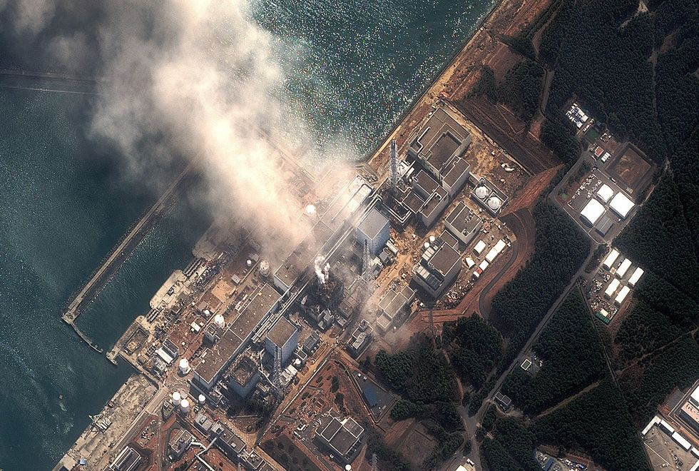

## Nuclear power stations are commonly built near the sea

> ...research by Ensia suggests that at least 100 U.S., European, and Asian nuclear power stations built just a few meters above sea level could be threatened by serious flooding caused by accelerating sea-level rise and more frequent storm surges. ==[Vidal, John]{.ref-author title=Authors}. [Are Coastal Nuclear Power Plants Ready for Sea-Level Rise?](https://www.hakaimagazine.com/features/are-coastal-nuclear-power-plants-ready-for-sea-level-rise/){.ref-title title=Title}. [Hakai Magazine]{.ref-container title=Website}. [21 Aug 2018]{.ref-issued title=Issued}. [Retrieved 5 Oct 2019]{.ref-accessed title=Accessed}.==

## Flooding can kill cooling systems, leading to overheating

The scenario is as follows:

1.  Flooding knocks out electricity.
2.  Disabling control and cooling systems.
3.  Reactors overheat, meltdown, and can release radioactive material.

The abstract for [Uncertain seas, uncertain future for nuclear power](https://www.tandfonline.com/doi/abs/10.1177/0096340215571905?journalCode=rbul20#abstract), by researcher [Natalie Kopytko](https://environment.leeds.ac.uk/see/staff/8889/dr-natalie-kopytko) (University of Leeds), nicely summarizes the risks:

> Many nuclear power plants were situated next to the ocean to have ready access to huge volumes of water, and sometimes they were built on land that was not very high above mean sea level. These characteristics may cause problems if ocean levels rise the one or two meters that most climatologists project as a result of climate change. The core of the problem resides in nuclear power's dependence on two things: water and off-site power. Operating and safely shutting down a nuclear power plant require large supplies of cooling water, as well as the power to operate the control panels and the pumps that circulate the water. The Fukushima Daiichi accident happened after the facility lost its connection to the electrical grid and floodwaters caused the backup diesel generators to fail. While an earthquake caused the tsunami that led to the situation, a severe storm coupled with rising sea levels could have the same end result, especially in low-lying areas suffering from increased erosion caused by climate change. Off-site power losses, or "station blackouts," have long been a commonly recognized risk at nuclear power plants. Backup systems have worked in the past, but dramatically rising sea levels, more frequent and intense storms, and the associated erosion that goes with them could make backup electrical systems problematic. To complicate the situation, the same storm and flood that affects a given power plant also interferes with the plant's communication and transportation networks, hampering the ability of personnel to respond to any crisis at the facility. At a minimum, climate change and the resulting rise in sea level will lead to concerns about the safety and cost of nuclear power plant operation and construction.

## That is what happened in Fukushima

March 2011 tsunami broke through the Fukushima Daiichi plant's flood defenses. Cut off power to control room and coolant systems. Without cooling, fuel in three reactors melted down. Explosive hydrogen gas built up, blowing holes in the reactor containment building. Seawater was pumped into the reactors to avoid worse. It was a close call. Japan's prime minister later admitted that the country came within a "paper-thin margin" of meltdowns that would have required the evacuation of 50 million people from nearby areas (including Tokyo). As is, 400,000 were evacuated, and most have not been able to return home. ==[Gilligan, Andrew]{.ref-author title=Authors}. [Fukushima: Tokyo Was on the Brink of Nuclear Catastrophe, Admits Former Prime Minister](https://www.telegraph.co.uk/news/worldnews/asia/japan/12184114/Fukushima-Tokyo-was-on-the-brink-of-nuclear-catastrophe-admits-former-prime-minister.html){.ref-title title=Title}. [The Telegraph]{.ref-container title=Newspaper}. [2 Mar 2016]{.ref-issued title=Issued}. [Retrieved 5 Oct 2019]{.ref-accessed title=Accessed}.==

## 25% of working nuclear reactors are on coastlines

Exposure is high:

-   The world has 460 working commercial nuclear reactors. ==[Vidal, John]{.ref-author title=Authors}. [Are Coastal Nuclear Power Plants Ready for Sea-Level Rise?](https://www.hakaimagazine.com/features/are-coastal-nuclear-power-plants-ready-for-sea-level-rise/){.ref-title title=Title}. [Hakai Magazine]{.ref-container title=Website}. [21 Aug 2018]{.ref-issued title=Issued}. [Retrieved 5 Oct 2019]{.ref-accessed title=Accessed}.==
-   50 are under construction. Another 150 are planned.
-   25% are on coastlines. Many only 10-20 meters above sea level.
-   China: 45 operational. 15 under construction. ==[Nuclear Power in China](https://www.world-nuclear.org/information-library/country-profiles/countries-a-f/china-nuclear-power.aspx){.ref-title title=Title}. [World Nuclear Association]{.ref-container title=Website}. [Oct 2019]{.ref-issued title=Issued}. [Retrieved 15 Nov 2019]{.ref-accessed title=Accessed}.== 15 (and many of the ones under construction) are on the coast.
-   US: 9 plants are within 3km of ocean. Already, 20 flooding incidents have been recorded since early 80's. ==[Lochbaum, David]{.ref-author title=Authors}. [Flooding at the Nuclear Plant](https://allthingsnuclear.org/dlochbaum/flooding-at-the-nuclear-plant){.ref-title title=Title}. [All Things Nuclear]{.ref-container title=Website}. [6 Oct 2015]{.ref-issued title=Issued}. [Retrieved 15 Nov 2019]{.ref-accessed title=Accessed}.==
-   UK: 12 of 19 sites vulnerable
-   Spent nuclear fuel often stored on site. E.g. At 12 of 19 sites in the UK. ==[2012 UK Government Report on Risks of Erosion and Coastal Flooding at Nuclear Power Plants](https://www.scribd.com/document/84289220/Nuclear-sites){.ref-title title=Title}. [Scribd]{.ref-container title=Website}. [Retrieved 15 Nov 2019]{.ref-accessed title=Accessed}.==

## Designs and regulations are outdated

Older plants did not factor in sea level rise. And current IAEA regulations (2011) say operators "should take into account" 18-59 cm sea level rise by 2100. Per the (outdated) 2007 IPCC AR4 report. Projections of potential sea level rise go considerably higher (see: [Rising Seas](/posts/rising-seas/)).

[Hinkley Point C](https://en.wikipedia.org/wiki/Hinkley_Point_C_nuclear_power_station) in the UK provides a case study:

-   Under construction in UK. Target completion 2028. \$25 billion US cost.
-   Concrete sea wall 12.5 meters, 900 meters long.
-   +50 year operating life span. Approx 100 years until reactors are decommissioned.

::: #references

## Referenced works
* [Gilligan, Andrew]{.ref-author title=Authors}. [Fukushima: Tokyo Was on the Brink of Nuclear Catastrophe, Admits Former Prime Minister](https://www.telegraph.co.uk/news/worldnews/asia/japan/12184114/Fukushima-Tokyo-was-on-the-brink-of-nuclear-catastrophe-admits-former-prime-minister.html){.ref-title title=Title}. [The Telegraph]{.ref-container title=Newspaper}. [2 Mar 2016]{.ref-issued title=Issued}. [Retrieved 5 Oct 2019]{.ref-accessed title=Accessed}.
* [Lochbaum, David]{.ref-author title=Authors}. [Flooding at the Nuclear Plant](https://allthingsnuclear.org/dlochbaum/flooding-at-the-nuclear-plant){.ref-title title=Title}. [All Things Nuclear]{.ref-container title=Website}. [6 Oct 2015]{.ref-issued title=Issued}. [Retrieved 15 Nov 2019]{.ref-accessed title=Accessed}.
* [Vidal, John]{.ref-author title=Authors}. [Are Coastal Nuclear Power Plants Ready for Sea-Level Rise?](https://www.hakaimagazine.com/features/are-coastal-nuclear-power-plants-ready-for-sea-level-rise/){.ref-title title=Title}. [Hakai Magazine]{.ref-container title=Website}. [21 Aug 2018]{.ref-issued title=Issued}. [Retrieved 5 Oct 2019]{.ref-accessed title=Accessed}.
* [Nuclear Power in China](https://www.world-nuclear.org/information-library/country-profiles/countries-a-f/china-nuclear-power.aspx){.ref-title title=Title}. [World Nuclear Association]{.ref-container title=Website}. [Oct 2019]{.ref-issued title=Issued}. [Retrieved 15 Nov 2019]{.ref-accessed title=Accessed}.
* [2012 UK Government Report on Risks of Erosion and Coastal Flooding at Nuclear Power Plants](https://www.scribd.com/document/84289220/Nuclear-sites){.ref-title title=Title}. [Scribd]{.ref-container title=Website}. [Retrieved 15 Nov 2019]{.ref-accessed title=Accessed}.
:::
