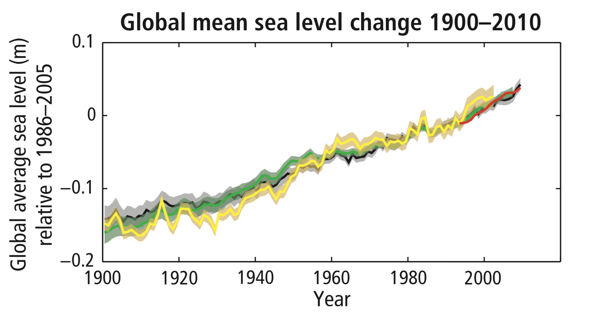

## Preface

### How do we define “sea level rise”?

“Sea level rise” most commonly refers to **changes in the global mean sea level** (GMSL), which is the mean height of the ocean surface as measured from the center of the earth. 

Estimates of future sea level rise are typically expressed as _relative to the mean of the 1986-2000 period_. For example, in the following graph showing sea level rise since 1900 ^[[@pachauri2015]], the zero point on the Y-axis is the 1986-2000 mean. IPCC projections (e.g. 0.52 - 0.98 m by 2100) are also relative to the 1986-2000 mean.

### How do we measure sea level rise?

**Satellite altimeters** since Sep 1993. High quality (accuracy within few centimeters), near global coverage of both absolute and local sea levels. Satellites send microwave pulses to the surface and measure the time to return.[^2][^3]

**Coastal tide-gauges** for prior to 1993. Gathered from a network of gauges around the world. They provide only local sea levels. There are geographical gaps in coverage; more so the further back we go. Collection started in 1675 in Amsterdam. Converting into global mean sea level is done by comparing with overlapping satellite altimeter data, and eliminating regional variations caused by factors such as vertical land motion.[^4][^5]

### What causes sea level rise?

1. **Thermal expansion**: water expands in volume as it warms. Over 90% of the heat trapped by greenhouse gases is being trapped by the oceans. [^6]
2. **Melting of temperate glaciers** (glaciers that are at melting point year round.)[^7] E.g. Glaciers in non-polar regions.
3. Melting of ice sheets in **Greenland and Antarctica**.
4. Changes to **land water storage**. E.g. Draining an underground aquifer for drinking water, which then flows into the ocean. These have to-date represented a “small contribution”, according to the IPCC.[^8] 

IPCC AR5 report said:

> Ocean thermal expansion and glacier melting have been the dominant contributors to 20th century global mean sea level rise. Observations since 1971 indicate that thermal expansion and glaciers (excluding Antarctic glaciers peripheral to the ice sheet) explain **75%** of the observed rise. … The contribution of the Greenland and Antarctic ice sheets has increased since the early 1990s, partly from increased outflow induced by warming of the immediately adjacent ocean.[^9]

## Sea level rise is accelerating

GMSL rise average in mm/year:

* 1901-2010 - 1.7 mm[^10]
* 1997-2006 - 3.04 mm[^11] 
* 2007-2016 - 4.36 mm[^12]
* 2014-2019 - 5 mm[^13] 

## Greenland and Antarctica ice sheets will be the largest contributors, going forward

Per a September 2019 report from the World Meteorological Organization: 

> “The contribution of land ice melt from the world glaciers and the ice sheets has increased over time and now dominate the sea level budget, rather than thermal expansion.”[^14]

### Greenland and Antarctic ice would raise global mean sea levels **65 m** if melted completely

Individually, they contain the following sea level rise potential:

* [Greenland ice sheet](https://en.wikipedia.org/wiki/Greenland_ice_sheet): **7.2 m**.
* [West Antarctic Ice Sheet (WAIS)](https://en.wikipedia.org/wiki/West_Antarctic_Ice_Sheet): **4.8 m**.
* [East Antarctic Ice Sheet (EAIS)](https://en.wikipedia.org/wiki/East_Antarctic_Ice_Sheet): **53.3m**.

### Antarctic melting has tripled in a decade 

A 2018 report by 80 scientists[^15] said the melt rate of Antarctic ice sheets had tripled in the past decade: from 73 billion tons a decade ago, to 219 billion tons in 2012-2017.[^16] Most of this melting was attributed to Pine Island and Thwaites glaciers on the West Antarctic ice sheet.

That tripling is particularly alarming given a 2016 report from James Hansen and team that estimated sea levels could rise **1 m** over 50 years if ice melt merely _doubled_ every decade.[^17]   

### West Antarctic glaciers have entered “unstoppable” collapse

That was the conclusion of two 2014 reports. [^18][^19] These six glaciers are essentially the cork in the wine bottle for the rest of the West Antarctic Ice Sheet. Researchers made the conclusion after observing the grounding line of the glaciers retreating over 19 years. Grounding lines are the “dividing line between land and water underneath the glacier.”[^20] 

### There are multiple hypothesized run away effects by which ice sheets could dramatically accelerate their collapse.

#### Marine ice sheet instability (MISI)

First proposed in 1978 by glaciologist John Mercer[^21].

[Marine ice sheets](https://en.wikipedia.org/wiki/Marine_ice_sheet_instability) are ice sheets that are in the ocean, but grounded to the sea floor by their sheer mass. They are stable in this configuration. If water gets beneath them, however, they float and break up through calving. 

If the ground below the marine ice sheets slopes downwards the further inland it goes (_reverse bed slope_), the grounding line accelerates as it moves forward. This is because the ice above is gets progressively thicker, and the thicker the ice is, the more vulnerable it is to floatation and calving.

The trigger for this process is ice shelve breakup. Ice shelves float on the surface of the ocean, forming a buttress around the edge of the grounded ice mass. As the atmosphere and ocean warm, they accelerate the breakup of ice shelves, which  eventually advances the grounding line beneath the ice mass to the point where it is traveling down the slope of the bowl of the marine ice sheet. 

This process would hit West Antarctica hardest, as it has large marine ice sheets.

![Marine Ice Sheet instability hypothesis flow chart. Source: Davies, Betham. “Marine ice sheet instability.” AntarcticGlaciers.org. 16 Sep 2014, \[http://www.antarcticglaciers.org/glaciers-and-climate/ice-ocean-interactions/marine-ice-sheets/\]](marine-ice-sheet-instability-hypothesis.png)

#### Marine ice cliff instability (MICI)

This is a newer hypothesis, and still being debated. The idea is intuitive: ice cliffs higher than 90 meters collapse due to the physics of ice. The collapse process will accelerate if the ice mass gets thicker the further back it goes (as most do), as the ice collapsing at the edge of the mass reveals ever-higher, faster-collapsing ice behind.

## Other cascade effects

### Albedo effect

> Albedo (al-bee-doh) is a measure of how much light that hits a surface is reflected without being absorbed. Something that appears white reflects most of the light that hits it (high albedo), while something that appears dark absorbs most of the light (low albedo).[^22]

As white ice melts, it reveals darker ocean and land below. These surfaces absorb  more of the sun’s light as warmth. It has been estimated this could mean a warming “…equivalent to 25 years of global carbon emissions.”[^23]

Forest fires could also contribute to the albedo effect, by depositing black soot on ice sheets.

### Methane release from melting permafrost

The Arctic contains vast quantities of frozen permafrost. As the planet warms, this permafrost melts, and has the potential to release greenhouse gases, including methane, which has a greenhouse effect several dozen times more powerful than CO2.[^24]

## There is historical precedence for rapid sea level rise driven by ice sheet breakup

### “Meltwater pulses” saw sea levels rise 40-60 mm per year for centuries

The last glacial maximum was 20,000 years ago. Deglaciation subsequently raised sea levels about **100 m over 17,000 years**. During which there were several “Meltwater Pulses”—periods of accelerated sea level rise triggered by major ice-loss events related to ice sheet collapse:[^25]

* **1A:** 16-25 m rise over 400-500 years, for **40–60 mm** annual mean rate.[^26]
* **1B:** Lots of disagreement over timing and magnitude. A 2004 estimate said: 13 m rise over 300 years, for **40 mm** annual mean rate.[^27]
* **1C:**6.5 m rise over 140 years, for **46 mm** annual mean rate.

## Sea level rise will not be uniform

Sea levels are not the same everywhere. Local coastal sea level elevations (aka: relative sea level) can vary widely from region to region, due to several factors:

1. **Variations in oceanic temperature**. The volume of warm water is greater than cold water, so variations in temperature (due to currents, etc) translate into variations in sea level. In the 22 years between Jan 1993 and Dec 2014, sea levels on the west coast of the US _dropped_, because waters there were cooled by the [pacific decadal oscillation](https://en.wikipedia.org/wiki/Pacific_decadal_oscillation).[^28]
2. **Variations in vertical land motion**. Some land masses are sinking (subsidence), while others are rising (uplift). Jakarta, for example, is rapidly subsiding due to the draining of underlying fresh water aquifers; North Jakarta has sunk 2.5m in 10 years.[^29] Whereas in Canada, areas formerly depressed by glaciers in the last ice age are rebounding by as much as 16 mm per year (a process called [glacial isostatic adjustment](https://en.wikipedia.org/wiki/Post-glacial_rebound)).[^30]
3. **Gravity**. As the polar ice sheets melt, water that was bound up in them at the poles is pulled by gravity into a more even global distribution. This is experienced as greater relative rise the closer one is to the equator.
4. **Salinity**. Salinity increases the density of water (similar to the effect of a decrease in temperature) which reduces the volume.

Per the 2019 IPCC Oceans and Cryosphere report: 

> Sea level projections show regional differences around GMSL. Processes not driven by recent climate change, such as local subsidence caused by natural processes and human activities, are important to relative sea level changes at the coast (high confidence). While the relative importance of climate-driven sea level rise is projected to increase over time, local processes need to be considered for projections and impacts of sea level (high confidence).[^31]

## Projections of sea level rise are trending higher

* **IPCC 2014**: 0.52 – 0.98 m (by 2100, under RCP8.5). [^32]
* **IPCC  2019**: 0.61 – 1.10 m  (by 2100, under RCP8.5). [^33]
* **2015**: NASA: Minimum 1 m by 2100.
* **2017**: National Oceanic and Atmospheric Administration (NOAA): 2.5 meters possible by 2100.
* **2018**: Richard Alley: 4.5 to 6.0 m possible by 2100, “if the worst happened”.[^34]

Jeff Goodell says “The uncertainty is moving towards higher scenarios, rather than low.”[^35] Richard Alley uses the graph below to plot the probability of various scenarios, and says everything we’re learning is only fattening the right side of the curve.[^36]

### Antarctica is the primary cause for increasing projections

In the 2014 IPCC report, it was understood that Antarctica would be an increasingly important driver of sea level rise going forward, but it was felt that models of ice sheet breakup were too uncertain to incorporate into GMSL projections. Since then, we have 1) observed accelerating Antarctic melting, and 2) learned more about the processes by which ice sheets break up. And so newer reports are more confidently incorporating Antarctic melting into their projections. For example, compare the 2014 and 2019 IPCC reports:

2014 AR5:

> There is low confidence in the available models’ ability to project solid ice discharge from the Antarctic ice sheet. Hence, these models likely underestimate the Antarctica ice sheet contribution.[^37]

2019 Oceans and Cryosphere:[^38]

> Mean sea level rise projections are higher by 0.1 m compared to AR5 under RCP8.5 in 2100, and the likely range extends beyond 1 m in 2100 due to a larger projected ice loss from the Antarctic Ice Sheet (medium confidence)

In general, IPCC reports tend towards more conservative projections, in part because they reflect the consensus opinion of many authors.

## My estimate for sea level rise: 0.35 m by 2050.

Melt rates seem to be accelerating. World Meteorological Society figures from September 2019 are: annual GMSL rise of **3.04 mm** for 1997-2006 and **4.36** for 2007-2016. That’s a **1.43x** decade-over-decade multiplier. If we extrapolate that out over the century, we get the following rates for ten decades of (figures rounded to first decimal place): **3, 4.3, 6.2, 8.9, 12.7, 18.2, 26, 37.2, 53.2, 76** (mm / year). Which translates into the following estimates:

* **0.35** m by 2050
* **2.45** m by 2100

That seems reasonable to me. It is greater than the (outdated and conservative) IPCC AR5 worst-case figures, but also below Richard Alley’s worst case 4.5-6.0 estimate. On his scenario probability graph, my estimate sits about 75% along the x-axis.

## No matter what we do, some sea level rise is “baked in”

The heat already in the ocean will continue to drive sea level rise, even if we could magically stop all emissions today. But we still need to rapidly reduce emissions, because the hotter the world is, the more sea level rise we will see, and the faster it will happen.

* **2°C:** Even if we reduce emissions enough to keep ourselves to (optimistic) 2°C warming, sea levels will eventually (over millennia) rise six meters.[^39] Or 7.5-18 m, according to Jeff Goodell.[^40] 
* **3°C:** It may take centuries or even millennia, but at just 3°C warming, sea level will rise at least 50 m says ocean chemist David Archer.[^41] The US Geological Survey 80 m, ultimately.[^42]
* **4°C:** “The last time the earth was 4°C warmer… there was no ice at either pole and sea level was 260’ higher. There were palm trees in the Arctic.”[^43] 

[^1]:	IPCC. “Climate Change 2014: Synthesis Report.” 2014, [https://www.ipcc.ch/report/ar5/syr/](https://www.ipcc.ch/report/ar5/syr/). 57

[^2]:	Church, J.A. & White, N.J. “Sea-Level Rise from the Late 19th to the Early 21st Century.” _Surveys in Geophysics._ 30 Mar 2011, [https://doi.org/10.1007/s10712-011-9119-1](https://doi.org/10.1007/s10712-011-9119-1)

[^3]:	“Sea level rise: Sea level measurement.” Wikipedia. [https://en.wikipedia.org/wiki/Sea\_level\_rise](https://en.wikipedia.org/wiki/Sea_level_rise)

[^4]:	Church, J.A. & White, N.J. “Sea-Level Rise from the Late 19th to the Early 21st Century.” _Surveys in Geophysics._ 30 Mar 2011, [https://doi.org/10.1007/s10712-011-9119-1](https://doi.org/10.1007/s10712-011-9119-1)

[^5]:	“Sea level rise: Sea level measurement.” Wikipedia. [https://en.wikipedia.org/wiki/Sea\_level\_rise](https://en.wikipedia.org/wiki/Sea_level_rise)

[^6]:	IPCC. “Climate Change 2014: Synthesis Report.” 2014, [https://www.ipcc.ch/report/ar5/syr/](https://www.ipcc.ch/report/ar5/syr/). 40

[^7]:	“Glacier: Classification by thermal state.” Wikipedia. [https://en.wikipedia.org/wiki/Glacier#Classification\_by\_thermal\_state](https://en.wikipedia.org/wiki/Glacier#Classification_by_thermal_state)

[^8]:	IPCC. “Climate Change 2013: The Physical Science Basis” 2013, [https://www.ipcc.ch/report/ar5/wg1/](https://www.ipcc.ch/report/ar5/wg1/). 1140

[^9]:	IPCC. “Climate Change 2013: The Physical Science Basis” 2013, [https://www.ipcc.ch/report/ar5/wg1/](https://www.ipcc.ch/report/ar5/wg1/). 1140

[^10]:	IPCC. “Climate Change 2014: Synthesis Report.” 2014, [https://www.ipcc.ch/report/ar5/syr/](https://www.ipcc.ch/report/ar5/syr/). 58

[^11]:	World Meteorological Organization. “The Global Climate in 2015–2019.” _WMO Statements on Climate._ 22 Sep 2019, [https://public.wmo.int/en/media/press-release/global-climate-2015-2019-climate-change-accelerates](https://public.wmo.int/en/media/press-release/global-climate-2015-2019-climate-change-accelerates). 8

[^12]:	World Meteorological Organization. “The Global Climate in 2015–2019.” _WMO Statements on Climate._ 22 Sep 2019, [https://public.wmo.int/en/media/press-release/global-climate-2015-2019-climate-change-accelerates](https://public.wmo.int/en/media/press-release/global-climate-2015-2019-climate-change-accelerates). 8

[^13]:	World Meteorological Organization. “The Global Climate in 2015–2019.” _WMO Statements on Climate._ 22 Sep 2019, [https://public.wmo.int/en/media/press-release/global-climate-2015-2019-climate-change-accelerates](https://public.wmo.int/en/media/press-release/global-climate-2015-2019-climate-change-accelerates). 8

[^14]:	World Meteorological Organization. “The Global Climate in 2015–2019.” _WMO Statements on Climate._ 22 Sep 2019, [https://public.wmo.int/en/media/press-release/global-climate-2015-2019-climate-change-accelerates](https://public.wmo.int/en/media/press-release/global-climate-2015-2019-climate-change-accelerates). 8

[^15]:	IMBIE team. “Mass balance of the Antarctic Ice Sheet from 1992 to 2017.” _Nature 558._ 2018, [https://doi.org/10.1038/s41586-018-0179-y](https://doi.org/10.1038/s41586-018-0179-y)

[^16]:	Mooney, Chris. “Antarctic ice loss has tripled in a decade. If that continues, we are in serious trouble.” _Washington Post._ 13 June 2018, [https://www.washingtonpost.com/news/energy-environment/wp/2018/06/13/antarctic-ice-loss-has-tripled-in-a-decade-if-that-continues-we-are-in-serious-trouble/](https://www.washingtonpost.com/news/energy-environment/wp/2018/06/13/antarctic-ice-loss-has-tripled-in-a-decade-if-that-continues-we-are-in-serious-trouble/)

[^17]:	Rignot, EMouginot, JMorlighem, MSeroussi, HScheuchl, B. “Widespread, rapid grounding line retreat of Pine Island, Thwaites, Smith, and Kohler glaciers, West Antarctica, from 1992 to 2011.” _Geophysical Research Letters, 41(10), 3502-3509._ 2014, [http://dx.doi.org/10.1002/2014GL060140](http://dx.doi.org/10.1002/2014GL060140)

[^18]:	Rignot, EMouginot, JMorlighem, MSeroussi, HScheuchl, B. “Widespread, rapid grounding line retreat of Pine Island, Thwaites, Smith, and Kohler glaciers, West Antarctica, from 1992 to 2011.” _Geophysical Research Letters, 41(10), 3502-3509._ 2014, [http://dx.doi.org/10.1002/2014GL060140](http://dx.doi.org/10.1002/2014GL060140)

[^19]:	Associated Press. “Scientists warn of rising sea levels as huge Antarctic ice sheet slowly melts.” 12 May 2014, [https://www.ctvnews.ca/sci-tech/scientists-warn-of-rising-sea-levels-as-huge-antarctic-ice-sheet-slowly-melts-1.1817870](https://www.ctvnews.ca/sci-tech/scientists-warn-of-rising-sea-levels-as-huge-antarctic-ice-sheet-slowly-melts-1.1817870)

[^20]:	VideoFromSpace. “Unstoppable Antarctic Glacier Melt: How Scientists Figured It.” _YouTube._ 13 May 2014.[https://www.youtube.com/watch?v=xoq2To5aleU](https://www.youtube.com/watch?v=xoq2To5aleU)

[^21]:	Mercer, John. “West Antarctic ice sheet and CO2 greenhouse effect: a threat of disaster.” _Nature 271._ 26 Jan 1978, [https://doi.org/10.1016%2F0033-5894%2878%2990098-4](https://doi.org/10.1016%2F0033-5894%2878%2990098-4)

[^22]:	North Carolina Climate Office. “Albedo.” [https://climate.ncsu.edu/edu/Albedo](https://climate.ncsu.edu/edu/Albedo)

[^23]:	Wallace-Wells, David. “The Uninhabitable Earth.” Tim Duggan Books, 2019. 67

[^24]:	Wallace-Wells, David. “The Uninhabitable Earth.” Tim Duggan Books, 2019. 66

[^25]:	“Early Holocene sea level rise.” Wikipedia. [https://en.wikipedia.org/wiki/Early\_Holocene\_sea\_level\_rise](https://en.wikipedia.org/wiki/Early_Holocene_sea_level_rise)

[^26]:	“Meltwater pulse 1A.” Wikipedia. [https://en.wikipedia.org/wiki/Meltwater\_pulse\_1A](https://en.wikipedia.org/wiki/Meltwater_pulse_1A)

[^27]:	“Meltwater pulse 1B.” Wikipedia. [https://en.wikipedia.org/wiki/Meltwater\_pulse\_1B](https://en.wikipedia.org/wiki/Meltwater_pulse_1B) 

[^28]:	NASAJPL Edu. “Watching Rising Seas From Space.” _YouTube._ 2 Sep 2015, [https://www.youtube.com/watch?v=z2UKvrU5rOk](https://www.youtube.com/watch?v=z2UKvrU5rOk). 1:24

[^29]:	“Jakarta, the fastest-sinking city in the world.” _BBC._ 13 Aug 2018, [https://www.bbc.com/news/world-asia-44636934](https://www.bbc.com/news/world-asia-44636934)

[^30]:	Lemmen, D.S., Warren, F.J., James, T.S. and Mercer Clarke, C.S.L. editors. “Canada’s Marine Coasts in a Changing Climate.” _ Government of Canada._ 2016. [https://www.nrcan.gc.ca/environment/resources/publications/impacts-adaptation/reports/assessments/2016/18388](https://www.nrcan.gc.ca/environment/resources/publications/impacts-adaptation/reports/assessments/2016/18388). 52

[^31]:	IPCC. “Special Report on The Ocean and Cryosphere in a Changing Climate”. 25 Sep 2019, [https://www.ipcc.ch/srocc/home/](https://www.ipcc.ch/srocc/home/). 23

[^32]:	IPCC. “Climate Change 2013: The Physical Science Basis” 2013, [https://www.ipcc.ch/report/ar5/wg1/](https://www.ipcc.ch/report/ar5/wg1/). 1140

[^33]:	IPCC. “Special Report on The Ocean and Cryosphere in a Changing Climate”. 25 Sep 2019, [https://www.ipcc.ch/srocc/home/](https://www.ipcc.ch/srocc/home/). 23

[^34]:	Richard Alley. “National Climate Seminar.” _Bard Center for Environmental Policy._ Filmed 19 Sep 2018 [https://vimeo.com/292991175](https://vimeo.com/292991175). 40:00

[^35]:	Goodell, Jeff. “The Water Will Come.” _The Long Now Foundation._ Filmed 2 Apr 2019. [http://longnow.org/seminars/02019/apr/02/water-will-come/](http://longnow.org/seminars/02019/apr/02/water-will-come/). 21:14

[^36]:	Richard Alley. “National Climate Seminar.” _Bard Center for Environmental Policy._ Filmed 19 Sep 2018 [https://vimeo.com/292991175](https://vimeo.com/292991175). 40:00

[^37]:	IPCC. “Climate Change 2014: Synthesis Report.” 2014, [https://www.ipcc.ch/report/ar5/syr/](https://www.ipcc.ch/report/ar5/syr/). 90

[^38]:	IPCC. “Special Report on The Ocean and Cryosphere in a Changing Climate”. 25 Sep 2019, [https://www.ipcc.ch/srocc/home/](https://www.ipcc.ch/srocc/home/). 23

[^39]:	Wallace-Wells, David. “The Uninhabitable Earth.” Tim Duggan Books, 2019. 62

[^40]:	Goodell, Jeff. “The Water Will Come.” _The Long Now Foundation._ Filmed 2 Apr 2009. [http://longnow.org/seminars/02019/apr/02/water-will-come/](http://longnow.org/seminars/02019/apr/02/water-will-come/). 19:21

[^41]:	Wallace-Wells, David. “The Uninhabitable Earth.” Tim Duggan Books, 2019. 68

[^42]:	Wallace-Wells, David. “The Uninhabitable Earth.” Tim Duggan Books, 2019. 68

[^43]:	Wallace-Wells, David. “The Uninhabitable Earth.” Tim Duggan Books, 2019. 65