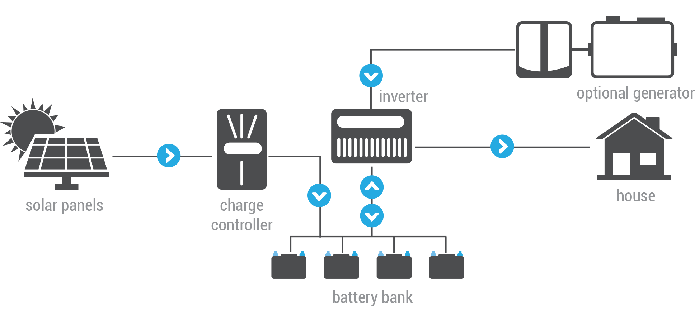

## Basic off-grid system



-   **Solar panels** convert sunlight to electricity and output DC power.
-   **Charge controller** takes DC power from panels, and regulates output.
-   **Battery bank** takes regulated DC output from controller, charges batteries, and outputs DC. ==[Best Solar Charge Controllers](https://www.renewableresourcescoalition.org/best-solar-charge-controllers/)==
-   **Backup generator** (e.g. gasoline), also ouputs DC to the inverter. ==Honda's generators are well-regarded. The [Ultra-Quiet 2200i](https://powerequipment.honda.ca/generators/EU2200i) weighs 46lbs, runs 8.1 hours on a single 3.6 litre tank, which costs \$4.60 at Nov 2019 Vancouver gas prices of \$1.30, and outputs max 2,200 watts (1,800 continuous) at 120 VAC.==
-   **Transfer switch** switches two sources of power. In our case: the battery bank and generator. Transfer switches can be manual or automatic (e.g. switch to generator when batteries are depleted).
-   **Inverter** takes 12 volt DC from battery bank, and outputs 120 volts AC, which is what home appliances run on.
-   **AC load center**. E.g a circuit breaker panel w/ switches, fuses and circuit breaker. Help organize load across different outlets and devices.
-   Home appliances plug into the outlets.

### Misc details

-   For top-rated panels, see: [Best selling panels in California for 2018](https://www.solar-estimate.org/news/what-are-the-best-solar-panels-to-buy-for-your-home-in-2019).
-   A south facing roof is best (assuming you're in the northern hemisphere). East and west facing are good. North facing is just OK. Optimal angle is 45°. ==[Energyhub.org](https://energyhub.org/british-columbia/#system-location)==
-   Clouds are fine.
    -   *"Ironically, solar panel kits work best under cold and cloudy conditions with full sun. This is because temperature af fects the efficiency of a solar panel; a 100-watt panel at room temperature will be become an 83-watt panel in 110 degrees."* ==[Best Solar Charge Controllers](https://www.renewableresourcescoalition.org/best-solar-charge-controllers/)==
-   Doubling your batteries gives redundancy for a critical-component.
-   Lithium Ion batteries: Lighter and cheaper than lead acid. *"Because of the better efficiency and deeper discharge depth, Lithium battery banks tend to be only 50-60% of the size of a comparable lead acid bank!"* ==[Off-Grid Battery Bank Sizing](https://www.wholesalesolar.com/solar-information/battery-bank-sizing)==
-   Solar-optimized charge controller: Cheap charge controllers only prevent batteries from overcharging. A charge controller designed for solar (e.g. a [Maximum Power Point Tracking](https://www.solar-electric.com/learning-center/mppt-solar-charge-controllers.html/) (MPPT) controller) provides more efficiency by better resolving the delta between the voltage of the solar panels and the batteries. See: [Best Solar Charge Controllers](https://www.renewableresourcescoalition.org/best-solar-charge-controllers/).
-   Pure sine-wave inverter: is better for your electronics.
-   Motors draw significantly more power during the first few seconds of operation: Can easily be 3x. So buy inverters that have more wattage than you think you need. Some also have two ratings: "surge" and "continuous".

## How much panel capacity?

The [simple formula](https://www.wholesalesolar.com/blog/how-to-size-solar-system/) for estimating a solar system is as follows:

``` bash
(Yearly kWh Usage ÷ 365 days ÷ average sun hours) x 1.15 efficiency factor = DC solar array size required.
```

To date, my studio apartment's average kWh consumption has been: **110 kWh/month**. That includes a fridge, dishwasher, washer/dryer, electronics, lights, etc. Times 12 months, that's **1320 kWh/year**.

I'm assuming **3.5 average hours sunlight** for Vancouver. That's the same value as [Seattle](https://www.wholesalesolar.com/solar-information/sun-hours-us-map). ClimaTemps claims an average of [5:01 hours](http://www.vancouver.climatemps.com/sunlight.php) sunlight per day, taking into account historical weather and variations in length of day by season. But I'll go with the more conservative 3.5 estimate.

With those figures, I get the following:

``` bash
(1320 ÷ 365 ÷ 3.5) x 1.15 = 1.18 kW
```

If I used SunPower [SPR-X21-335-BLK-D-AC](https://www.solarreviews.com/buyers-guide/solar-panels/sunpower/sunpo19768xseriessprx21335blkdac) panels (335 W, 21% efficiency), I could use **4 panels x 335W = 1340 watts**.

Those panels look to go for about \$1 USD per watt, so that's **\$1340 USD** for the panels. Then there are the costs of other system components and installation.

## Units

-   1 watt, flowing for 1 hour = 1 watt hour (Wh).
    -   40W lightbulb on for 8 hours = 320Wh
-   1000Wh = 1 kilowatt hour (kWh). This is what our utilities are billed in.
    -   1000W microwave on for 8 hours = 8000Wh = 8kWh
-   Amps x Volts = Watt.
    -   Fridge runnning at 127V and 2.4A = 305W.
    -   Using water pipe analogy, volts are water pressure, amps are flow through the pipe, adn watts are what we can do with that energy (e.g. turn a water wheel)
-   Batteries are rated in watt hours
    -   Yeti 400 battery is 396 Wh. It's 12 volts x 33 Amp hours = 396Wh.
    -   A 100W lightbulb would last four hours.
-   Solar panels are measured in watts.

## Wattage consumption examples

The power draw of portable Macs can be found in System Information \> Power \> AC Charger Information.

| Device                                                                                                          | Watts             |
|-----------------------------------------------------------------------------------------------------------------|-------------------|
| LED light bulb. E.g. [G9 dimmable](https://www.amazon.ca/Dimmable-Lights-Frosted-100-140V-listed/dp/B06VY1WVLW) | 4.5               |
| 55\" LED TV. E.g. Vizio P55-F1                                                                                  | 172 (0.5 standby) |
| MacBook Pro                                                                                                     | 86                |
| Freezer. E.g. 115 VAC, 5A draw (2x at peak).                                                                    | 575               |

## Kilowatt hours consumption examples

In 2019, my average monthly kWh consumption has been **110 kWh**.

| Device                                                                                                                                             | kWh / year |
|----------------------------------------------------------------------------------------------------------------------------------------------------|------------|
| Gaming PC (with display)                                                                                                                           | 1400       |
| Gaming console                                                                                                                                     | 134        |
| Average household PC                                                                                                                               | 246        |
| Fridge. E.g. [Kitchen Aid KBRS22KVSS4](https://www.searspartsdirect.com/manual/28iq82sm2l-000593/kitchenaid-kbrs22kvss4-bottom-mount-refrigerator) | 459        |

## Homes

Example builds:

-   [Gambier Island](https://www.youtube.com/watch?v=vQlgBYEqymE) - 3.12 KW panels, 40KW batteries, 8.5KW inverter
-   [Our Simple DIY Home Solar Power System](https://learn.eartheasy.com/articles/our-simple-diy-home-solar-power-system/). - 123 watt panels x 3, 2 x 232 amp hour batteries.

## Vehicles

Example builds:

-   [VanLife recommended equipment](https://kombilife.com/off-grid-solar-mobile-electrical-systems/)
-   [VanLife Mobile Electrical Systems Guide](https://kombilife.com/product/mobile-electrical-systems-off-grid-solar-guide/)
-   [How to Sleep in a Wrangler JK JL 2-Door](https://www.thelonejeeper.ca/2-How-to-Sleep-in-a-Jeep-JK-2-Doors.html "How to Sleep in a Wrangler JK JL 2-Door")

Auxiliary electrical system

-   [Great video on technique](https://www.youtube.com/watch?v=XzfrJJ6Px3o "Great video on technique")
-   Idea is to keep your auxiliary electrical system completely separate from your vehicle's original main system.
